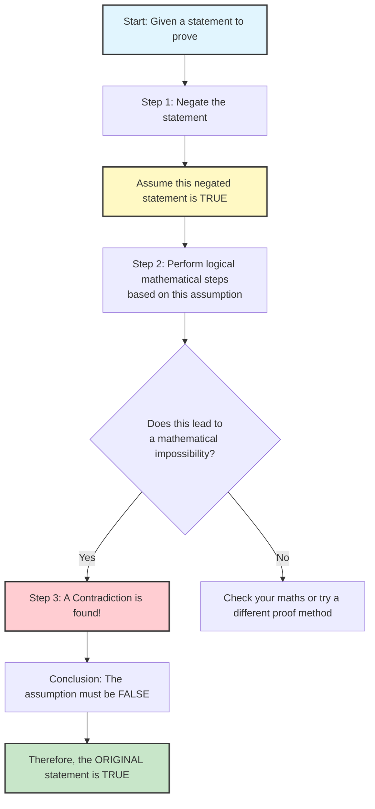

```markdown
# Mermaid Diagrams for A21 Proofs and Partial Fractions

**Unit code:** A21  
**Topic ID:** A21ProofsAndPartialFractions  

## A21ProofsAndPartialFractionsMMD-001: Logic Flowchart for Proof by Contradiction  

**Source:** AI-proposed teaching enhancement, not present in supplied lesson evidence  
**Related lesson section:** 8.1  
**Used in placeholder:** `[VISUAL PLACEHOLDER: A21ProofsAndPartialFractionsMMD-001 | ...]`  
**Purpose:** Flowchart showing the logical steps of a proof by contradiction.  

### Creation Notes  
This Mermaid diagram uses a top-down flowchart to visually break down the abstract logical steps of a proof by contradiction. It highlights the "assumption of the opposite" and the "discovery of a contradiction" as the key pivot points in the argument.


```

