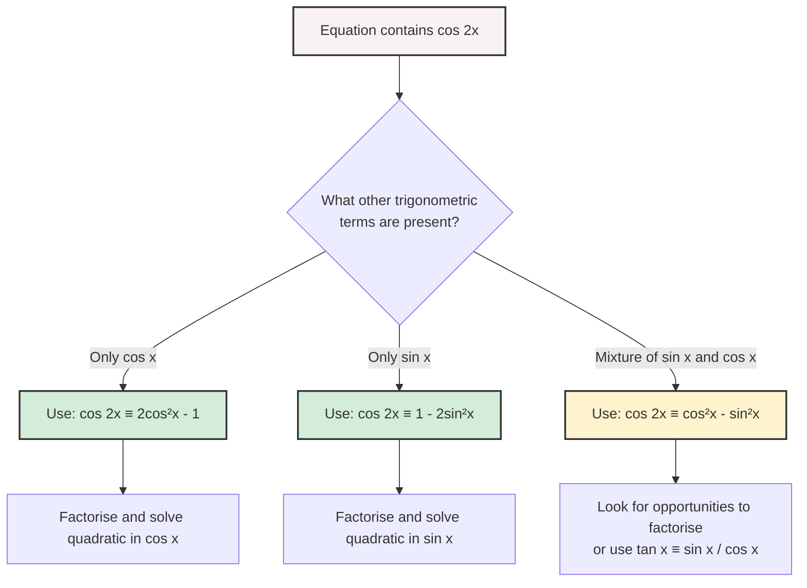

```markdown
# A21_trigonometry_and_modelling_mermaid.md

**Unit code:** A21
**Topic ID:** A21TrigonometryAndModelling

## A21TrigonometryAndModellingMMD-001: Choosing the Right Cosine Double Angle Formula

**Source:** AI-proposed teaching enhancement, not present in supplied lesson evidence
**Related lesson section:** 8.2
**Used in placeholder:** `[VISUAL PLACEHOLDER: A21TrigonometryAndModellingMMD-001 | Source: AI-proposed teaching enhancement | Insert from A21_trigonometry_and_modelling_mermaid.md | Purpose: Flowchart for selecting the correct cos(2A) identity]`
**Purpose:** Helps students decide which of the three $\cos 2A$ identities to use when solving equations.

### Creation Notes
The transcript explicitly notes that choosing the correct double angle identity for $\cos 2x$ is a critical step in solving equations (e.g., Example 2). This flowchart visualises that decision-making process.


```

