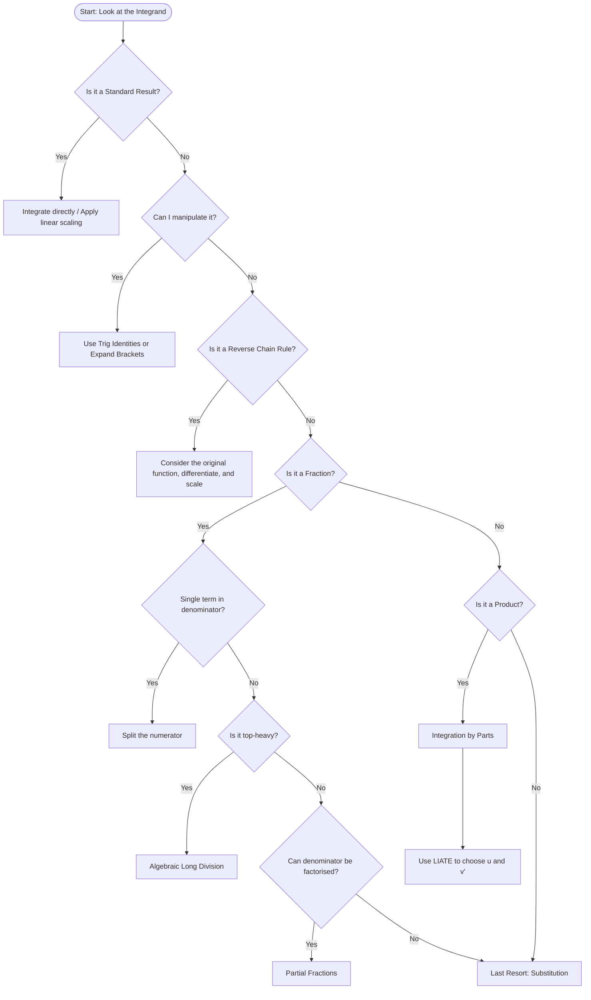

```markdown
A21_integration_mermaid.md
```

```markdown
# Mermaid Diagrams for A21 Integration  

**Unit code:** A21  
**Topic ID:** A21Integration  

## A21IntegrationMMD-001: Integration Strategy Flowchart  

**Source:** Transcript & PowerPoint slide 2  
**Related lesson section:** 8.1  
**Used in placeholder:** `[VISUAL PLACEHOLDER: A21IntegrationMMD-001 | Source: Transcript & PowerPoint slide 2 | Insert from A21_integration_mermaid.md | Purpose: Flowchart showing the decision-making process for integration techniques]`  
**Purpose:** Flowchart showing the decision-making process for selecting an integration technique.  

### Creation Notes  
This Mermaid diagram represents the hierarchical decision-making process taught in the lesson transcript. Mermaid is the right format because it cleanly handles top-down logical flowcharts, making it easy for students to follow the "if this, then that" logic of integration.  


```