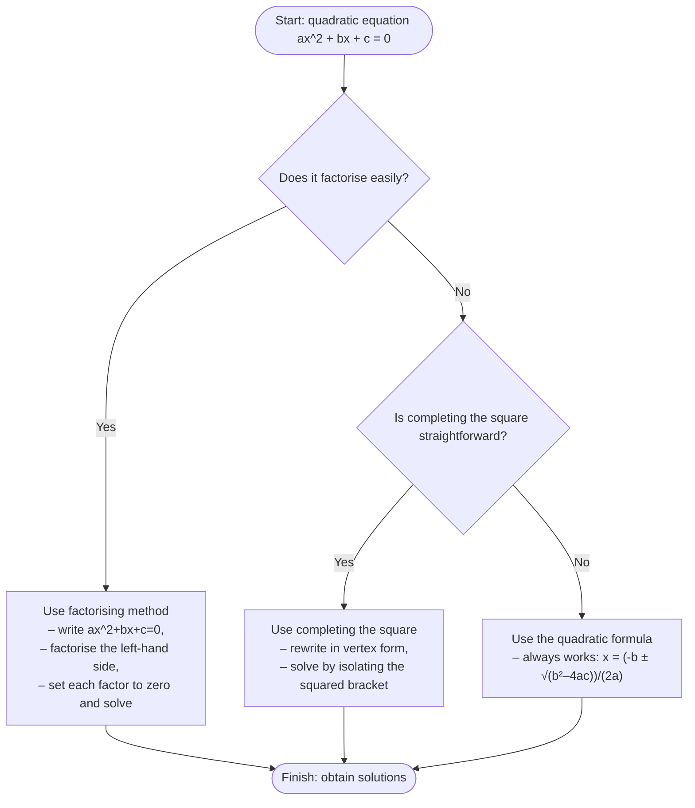
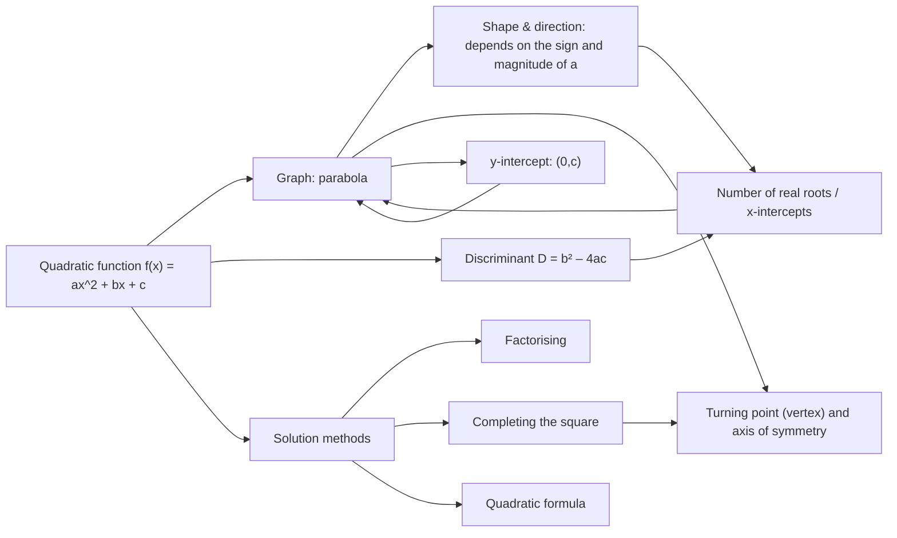

# Mermaid Diagrams for AS1 Quadratic Functions

## MMD-001: Decision tree for choosing a solution method
Source: AI‑proposed teaching enhancement, not present in lesson PDF  
Used in lesson placeholder: `[VISUAL PLACEHOLDER: MMD-001 | Source: AI‑proposed teaching enhancement, not present in lesson PDF | Insert from AS1_quadratic_functions_mermaid.md | Purpose: decision tree to help students choose the best method for solving a quadratic equation]`  
Purpose: This flowchart guides learners through the decision process when selecting an appropriate method (factorising, completing the square or using the quadratic formula) to solve a quadratic equation.

## MMD-002: Concept map linking quadratic features
Source: AI‑proposed teaching enhancement, not present in lesson PDF  
Used in lesson placeholder: `[VISUAL PLACEHOLDER: MMD-002 | Source: AI‑proposed teaching enhancement, not present in lesson PDF | Insert from AS1_quadratic_functions_mermaid.md | Purpose: concept map linking algebraic and graphical features of a quadratic function]`  
Purpose: This concept map summarises how different algebraic representations of a quadratic function relate to its graph, solutions and key properties.

