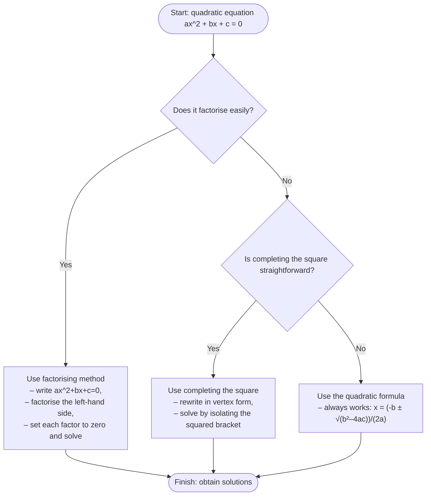
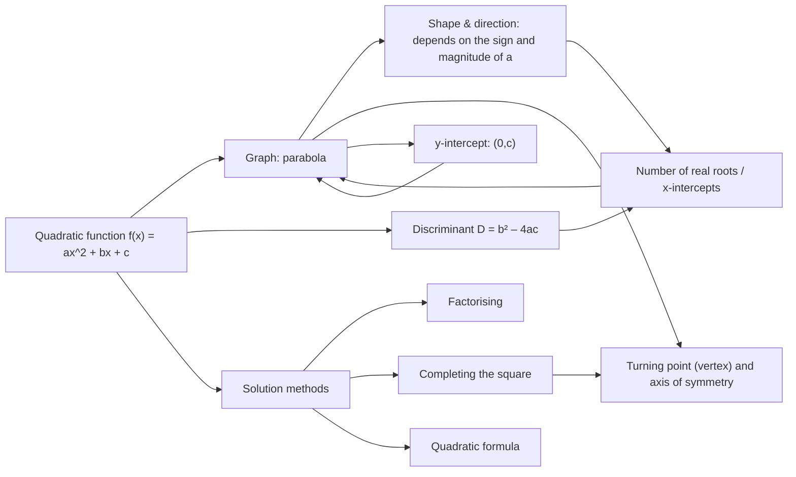

# AS1 Quadratic Functions – Solving, Graphs and Applications Lesson Agent Source

## 0. AI-Agent Usage Instructions

This file is a source for teaching, revision, explanation, diagnostics and lesson retrieval. Core lesson content is in Section 5. Diagram assets are in Section 6. Widgets are in Section 7. Use the lesson content before generated enhancement notes. Do not claim AI-proposed assets came from the original PDF. Preserve syllabus gap notes and uncertainty notes. Use UK/CCEA mathematical vocabulary.

## 1. Pack Metadata

```yaml
pack_type: lesson
unit_code: AS1
unit_name: CCEA AS1 Pure Mathematics
topic_slug: "02_quadratics"
topic_title: "Quadratic Functions – Solving, Graphs and Applications"
source_folder: "/Users/evanward/Documents/AS Portal - New /AS1 Files/02. Quadratics"
output_file: "/Users/evanward/Documents/AS Portal - New /AS1 Files/00_AGENT_SOURCE_PACKS/02_quadratics/AS1_quadratic_functions_agent_source.md"
created_from_files:
  lesson: "AS1_quadratic_functions_lesson.md"
  questions: null
  solutions: null
  mermaid: "AS1_quadratic_functions_mermaid.md"
  svg: "AS1_quadratic_functions_svg.md"
  tikz: "AS1_quadratic_functions_tikz.md"
  widgets: "AS1_quadratic_functions_widgets.md"
contains_lesson: true
contains_questions: false
contains_solutions: false
contains_mermaid: true
contains_svg: true
contains_tikz: true
contains_widgets: true
agent_use_cases:
  - teach topic
  - explain examples
  - retrieve definitions
  - retrieve diagrams
  - retrieve widgets
  - diagnose misconceptions
```

## 2. Source File Manifest

| Role | Source file | Lines | Bytes UTF-8 | SHA-256 |
|---|---|---:|---:|---|
| lesson | AS1_quadratic_functions_lesson.md | 390 | 29876 | `9c1a97eb24b006e6e3d9f10eb4fbbf3a6978907348d0846af055d927e85e092e` |
| mermaid | AS1_quadratic_functions_mermaid.md | 61 | 2755 | `0bb45617dc5a92e37aaf57ed55f4a5807cea87021b6058c83607aa571665f9ef` |
| svg | AS1_quadratic_functions_svg.md | 79 | 4223 | `92464396b1921764fe537499b03d95d1830386a258e4c5e95f3b1add121f8597` |
| tikz | AS1_quadratic_functions_tikz.md | 84 | 3837 | `b6fc9dd83ec9d35528faea81a19d607882e52df941a22712d120a3734432046f` |
| widgets | AS1_quadratic_functions_widgets.md | 345 | 14948 | `943db447fed4d2ecb3ebaf9ea44c4a0c092367cd9e6e176103fe98eb8f4bf3e4` |

## 3. Preservation and Retrieval Map

- Original Markdown is preserved verbatim inside labelled source-content sections.
- Mathematical notation, source labels, question IDs, pack IDs, visual placeholders, code blocks and generated/AI-proposed labels are retained.
- Diagram and widget files are separated by asset type so an AI agent can retrieve them without confusing them with explanatory prose.
- Audit details, warnings, file checksums and ID checks are stored in the companion audit file.

## 4. Source Navigation and Pack Boundaries

- Section 5 contains the core lesson Markdown.
- Section 6 contains Mermaid, SVG and TikZ visual assets in that order.
- Section 7 contains widget/HTML/CSS/JavaScript assets.
- Section 8 gives retrieval notes for downstream AI agents.
- Missing optional/expected roles: questions, solutions

## 5. Core Lesson Content

### Source File Metadata

```yaml
filename: "AS1_quadratic_functions_lesson.md"
absolute_path: "/Users/evanward/Documents/AS Portal - New /AS1 Files/02. Quadratics/AS1_quadratic_functions_lesson.md"
lines: 390
bytes_utf8: 29876
sha256: "9c1a97eb24b006e6e3d9f10eb4fbbf3a6978907348d0846af055d927e85e092e"
```

### Preserved Source Content: AS1_quadratic_functions_lesson.md

# Quadratic Functions – Solving, Graphs and Applications

**Unit:** CCEA AS1 Pure Mathematics  
**Source lesson PDF:** QUADRATIC FUNCTIONS.pdf  
**Date generated:** 22 May 2026

This lesson pack expands the material from the uploaded PDF into a full set of notes for independent study.  The structure follows the CCEA specification and elaboration document for AS1 Pure Mathematics【517932045546412†L474-L492】【202274881086976†L182-L213】.  Citations refer to these documents.  Diagrams and widgets are provided in separate files and referenced via placeholders.

---

## 1 Specification Alignment

The table below links each relevant specification point to the elaboration guidance.  It notes whether the topic is fully covered in this lesson and lists helpful visuals or widgets.  Specification statements are paraphrased from the official document【517932045546412†L474-L492】.

| Specification point | Elaboration guidance | Covered? | Where in notes | Gap/action | Visual or widget |
| --- | --- | --- | --- | --- | --- |
| Work with quadratic functions and their graphs – recognise the parabola shape, effect of the coefficient a and constant c, identify the turning point and axis of symmetry, interpret the number of real roots | Be aware of the conditions for distinct and non‑real roots; find the turning point by completing the square【202274881086976†L182-L213】. | Yes | §6.1 | None | TikZ‑001, MMD‑002, WIDGET‑001 |
| Solve quadratic equations by factorisation, completing the square and the quadratic formula | Solve equations where the unknown appears in a function; understand when to use each method【202274881086976†L195-L206】. | Yes | §6.2 | None | MMD‑001 |
| Use the discriminant to determine the number and type of real roots | Use b² − 4ac to classify the roots; apply inequalities in parameter questions【202274881086976†L190-L213】. | Yes | §6.3 | None | TIKZ‑002, WIDGET‑002 |
| Solve simultaneous equations (one linear and one quadratic) and interpret graphically | Use the discriminant to identify tangency or non‑intersection【202274881086976†L190-L213】. | Yes | §6.5 | None | — |
| Solve quadratic inequalities and interpret graphically | Solve linear and quadratic inequalities and interpret the solution on a number line【202274881086976†L233-L243】. | Yes | §6.4 | None | SVG‑001, WIDGET‑001 |
| Manipulate polynomials; perform simple algebraic division by a linear factor; apply the remainder and factor theorems; factorise cubic expressions | Perform long division, use the remainder theorem, identify factors, and fully factorise cubic polynomials【202274881086976†L245-L256】. | Yes | §6.6 – §6.7 | None | WIDGET‑003 |
| Sketch curves defined by simple equations, including quadratics | Find roots, intercepts, turning points and decide whether the graph crosses the x‑axis【202274881086976†L260-L265】. | Yes | Throughout the notes | None | TIKZ‑001, WIDGET‑001 |

---

## 2 Learning Objectives

By the end of this lesson you should be able to:

1. Describe the general form of a quadratic function \(y = ax^2 + bx + c\) and explain how the values of \(a\), \(b\) and \(c\) affect the graph.
2. Identify the turning point, axis of symmetry, y‑intercept and x‑intercepts of a quadratic graph.
3. Solve quadratic equations using factorisation, completing the square and the quadratic formula, choosing the appropriate method for a given equation.
4. Use the discriminant \(D = b^2 - 4ac\) to classify equations as having two, one or no real roots, and apply it to parameter problems.
5. Solve quadratic inequalities and represent solutions on a number line or in interval notation.
6. Determine the points of intersection between a line and a quadratic curve, identify tangency or lack of intersection, and interpret solutions in modelling contexts.
7. Perform polynomial division by a linear factor, use the remainder and factor theorems, and factorise cubic polynomials completely.
8. Avoid common errors such as sign mistakes, dropping the ± symbol and ignoring context.

---

## 3 Compact Prerequisite Recap

* **Linear functions:** The graph of \(y = mx + c\) is a straight line.  Gradient \(m\) controls steepness; \(c\) is the y‑intercept.
* **Factorising simple quadratics:** To factorise \(x^2 + bx + c\), find two numbers that multiply to \(c\) and sum to \(b\).  For example \(x^2 + 5x + 6 = (x+2)(x+3)\).
* **Solving by factorising:** Once the quadratic is set equal to zero, solve each factor equal to zero to find the roots.
* **Graphs of quadratics:** Positive \(a\) gives a U‑shaped graph; negative \(a\) gives an n‑shaped graph.  The constant \(c\) is the y‑intercept.  Roots correspond to x‑intercepts.
* **Inequalities:** When solving inequalities, if you multiply or divide by a negative number you must reverse the inequality sign.

---

## 4 Big Picture Explanation

Quadratic functions are fundamental in algebra and appear across mathematics and physics.  In AS‑level Pure Mathematics you will solve quadratic equations, sketch their graphs, and use them in contexts such as motion and optimisation.  The discriminant allows you to classify the nature of the roots without solving the equation fully, and polynomial division extends these ideas to higher‑degree polynomials.  Mastering quadratics now prepares you for calculus later in the course.  Exam questions often ask you to explain your reasoning clearly, choose an appropriate method and interpret solutions in context.

---

## 5 Key Definitions and Notation

* **Quadratic function:** A function of the form \(f(x) = ax^2 + bx + c\) with \(a \neq 0\).  Its graph is a parabola.
* **Coefficient \(a\):** Controls the direction and width of the parabola.  If \(a > 0\) the graph opens upwards; if \(a < 0\) it opens downwards.  A larger absolute value of \(a\) makes the graph steeper.
* **Turning point (vertex):** The maximum or minimum point of the graph.  It occurs at \(x = -b/(2a)\) and the y‑coordinate is \(f(-b/(2a))\).
* **Axis of symmetry:** The vertical line through the turning point given by \(x = -b/(2a)\).  The graph is symmetrical about this line.
* **Roots (solutions):** Values of \(x\) that satisfy \(ax^2 + bx + c = 0\).  They correspond to x‑intercepts when real.
* **Discriminant:** The expression \(D = b^2 - 4ac\).  If \(D > 0\) there are two distinct real roots, if \(D = 0\) there is one repeated real root, and if \(D < 0\) there are no real roots.
* **Polynomial division:** Dividing a polynomial \(f(x)\) by another yields a quotient \(Q(x)\) and remainder \(R\), satisfying \(f(x) = \text{divisor} \times Q(x) + R\).
* **Remainder theorem:** When dividing \(f(x)\) by \(x - a\), the remainder equals \(f(a)\).
* **Factor theorem:** \(x - a\) is a factor of \(f(x)\) if and only if \(f(a) = 0\).

---

## 6 Core Theory and Examples

### 6.1 Quadratic Functions and Graphs

A quadratic function \(y = ax^2 + bx + c\) produces a smooth, symmetrical curve called a parabola.  The sign of \(a\) determines whether the parabola opens upwards (if \(a\) is positive) or downwards (if \(a\) is negative).  The larger the absolute value of \(a\), the steeper the arms of the curve.

The key features to identify when sketching a parabola are:

1. **Direction and steepness:** Look at \(a\) to decide whether the graph opens up or down and whether it is narrow or wide.
2. **Axis of symmetry:** The line \(x = -b/(2a)\) splits the graph into two mirror images.
3. **Turning point:** This occurs at \(x = -b/(2a)\).  Substitute this value into the function to obtain the y‑coordinate.
4. **y‑intercept:** Set \(x = 0\) to find the point \((0, c)\).
5. **x‑intercepts (roots):** Solve \(ax^2 + bx + c = 0\).  The discriminant tells you how many real roots exist.

**Graph examples:**

* For \(y = x^2\) the graph opens upwards with turning point at (0, 0).  It touches the origin and has one repeated root.  The axis of symmetry is the y‑axis.
* For \(y = (x - 3)^2 - 4\), the graph opens upwards with turning point at (3, −4).  Expanding gives \(y = x^2 - 6x + 5\).  The discriminant is positive, so the graph crosses the x‑axis twice.
* For \(y = -x^2 + 2x + 1\), the graph opens downwards.  Completing the square or using \(x = -b/(2a)\) gives the turning point at (1, 2).  The discriminant is positive, so it crosses the x‑axis twice.

Remember these memory formulas:

* Axis of symmetry: \(x = -b/(2a)\).
* Turning point: \((-b/(2a),\, f(-b/(2a)))\).
* Discriminant: \(D = b^2 - 4ac\).

[VISUAL PLACEHOLDER: TIKZ‑001 | Source: AI‑proposed teaching enhancement, not present in lesson PDF | Insert from AS1_quadratic_functions_tikz.md | Purpose: illustrates different parabola shapes and turning points]

[VISUAL PLACEHOLDER: MMD‑002 | Source: AI‑proposed teaching enhancement, not present in lesson PDF | Insert from AS1_quadratic_functions_mermaid.md | Purpose: concept map linking algebraic form to graph features]

### 6.2 Solving Quadratic Equations

To solve \(ax^2 + bx + c = 0\), first rewrite the equation in standard form with one side equal to zero.  Then choose one of the following methods.

#### Factorisation

Factorising is the quickest method when the quadratic splits into two linear factors.  The steps are:

1. Write the equation in standard form \(ax^2 + bx + c = 0\).
2. Find numbers that multiply to \(a \times c\) and sum to \(b\).  Rewrite the middle term and factor by grouping.
3. Set each factor equal to zero and solve for \(x\).
4. Check your solutions in the original equation.

*Example:* Solve \(x^2 + 5x + 6 = 0\).  Factorising gives \((x+2)(x+3) = 0\), so the roots are \(x = -2\) and \(x = -3\).

#### Completing the square

Completing the square rewrites the quadratic in the form \(a(x - h)^2 + k\).  This method always works and reveals the turning point.  Steps:

1. If \(a\) is not 1, divide through by \(a\) so the coefficient of \(x^2\) is 1.
2. Take half of the coefficient of \(x\), square it, and add and subtract this square.
3. Group terms to form a perfect square and simplify the constants.
4. Solve the resulting equation by taking square roots and remember the ± symbol.

*Example:* Solve \(x^2 + 6x - 2 = 0\) by completing the square.  Write \(x^2 + 6x - 2 = (x + 3)^2 - 11\).  Set \((x + 3)^2 = 11\).  Taking the square root gives \(x + 3 = ±\sqrt{11}\), so \(x = -3 ± \sqrt{11}\).

#### Quadratic formula

When factorisation is difficult and completing the square is messy, use the quadratic formula:

\[x = ( -b ± √( b² − 4ac ) ) / (2a).\]

First compute the discriminant \(D = b^2 - 4ac\).  If \(D > 0\) there are two real solutions; if \(D = 0\) there is one repeated real solution; and if \(D < 0\) there are no real solutions.  Remember to include both the plus and minus cases.

*Example:* Solve \(2x^2 − 3x − 5 = 0\).  Here \(a = 2\), \(b = −3\), \(c = −5\).  The discriminant is 49.  Using the formula gives \(x = (3 ± 7)/4\), so \(x = 5/2\) or \(x = −1\).

#### Choosing a method

Use factorisation when the quadratic splits neatly; completing the square when you need the turning point or the discriminant is awkward; and the quadratic formula for general cases.  A flowchart in the mermaid file summarises this decision.

[VISUAL PLACEHOLDER: MMD‑001 | Source: AI‑proposed teaching enhancement, not present in lesson PDF | Insert from AS1_quadratic_functions_mermaid.md | Purpose: decision tree for choosing a solution method]

#### Common mistakes

* Not setting the equation equal to zero before solving.
* Dropping the ± sign when taking square roots.
* Sign errors in the discriminant or when expanding brackets.
* Incomplete factorisation (omitting common factors).
* Failing to check solutions in the original equation.

### 6.3 Discriminant and Roots

The discriminant \(D = b^2 - 4ac\) provides a quick way to determine how many real roots a quadratic equation has and how its graph meets the x‑axis.  The cases are:

| Discriminant | Number of real roots | Graph behaviour |
| --- | --- | --- |
| \(D > 0\) | Two distinct real roots | The parabola crosses the x‑axis twice |
| \(D = 0\) | One repeated real root | The parabola touches the x‑axis (tangent) |
| \(D < 0\) | No real roots | The parabola does not meet the x‑axis |

*Examples:* In \(x^2 + 5x + 6 = 0\) the discriminant is 1, so there are two distinct real roots (−2 and −3).  In \(2x^2 + 4x + 2 = 0\) the discriminant is 0, so there is one repeated root (−1).  In \(3x^2 + 2x + 5 = 0\) the discriminant is negative, so there are no real roots.

Parameter questions often ask you to find values of \(k\) that make \(x^2 + kx + 3 = 0\) have real roots.  Here \(D = k^2 - 12\).  Requiring \(D ≥ 0\) gives \(k ≤ -2√3\) or \(k ≥ 2√3\).

Common errors include using the wrong coefficients, forgetting that the discriminant only tells the number of real roots (not their values), and failing to state a clear conclusion.

[VISUAL PLACEHOLDER: TIKZ‑002 | Source: AI‑proposed teaching enhancement, not present in lesson PDF | Insert from AS1_quadratic_functions_tikz.md | Purpose: summarises discriminant cases with sketches]

[INTERACTIVE PLACEHOLDER: WIDGET‑002 | Source: AI‑proposed teaching enhancement, not present in lesson PDF | Insert from AS1_quadratic_functions_widgets.md | Purpose: interactively explore how changing a, b and c affects the discriminant and the graph]

### 6.4 Quadratic Inequalities

Quadratic inequalities involve expressions such as \(ax^2 + bx + c > 0\), \(< 0\), \(≥ 0\) or \(≤ 0\).  To solve them:

1. **Find the roots:** Solve the corresponding equation \(ax^2 + bx + c = 0\) to obtain critical values \(r_1\) and \(r_2\) (with \(r_1 < r_2\)).  If there is a repeated root, note its multiplicity.
2. **Draw a number line:** Mark \(r_1\) and \(r_2\).  Choose a test value in each interval (below \(r_1\), between \(r_1\) and \(r_2\), above \(r_2\)).  Substitute into \(ax^2 + bx + c\) to see if the result is positive or negative.
3. **Select the intervals** where the inequality holds.  Use open circles for strict inequalities (\(<\), \(>\)) and closed circles for non‑strict inequalities (\(≤\), \(≥\)).
4. **Write the solution set** in interval notation.

General patterns emerge depending on the sign of \(a\) and the direction of the inequality:

* If \(a > 0\) and you require \(ax^2 + bx + c > 0\), the solution lies **outside** the roots (below \(r_1\) or above \(r_2\)).
* If \(a > 0\) and you require \(ax^2 + bx + c < 0\), the solution lies **between** the roots (between \(r_1\) and \(r_2\)).
* If \(a < 0\) and you require \(ax^2 + bx + c > 0\), the solution lies **between** the roots.
* If \(a < 0\) and you require \(ax^2 + bx + c < 0\), the solution lies **outside** the roots.

If the discriminant is zero there is only one critical value.  For a strict inequality like \(ax^2 + bx + c > 0\), the inequality holds for all \(x\) except the repeated root.  For a non‑strict inequality like \(≥ 0\), the repeated root itself is included.

*Examples:* Solve \(x^2 − 4x − 5 < 0\).  Factorising gives roots at −1 and 5.  Because \(a > 0\) and the inequality is \(< 0\), the solution is between the roots: \(−1 < x < 5\).  Solve \(2x^2 + 3x − 2 > 0\).  The roots are −2 and 0.5.  The solution is outside these values: \(x < −2\) or \(x > 0.5\).  Solve \(3x^2 − 2x − 1 ≤ 0\).  The roots are −1/3 and 1.  Because \(a > 0\) and \(≤ 0\), include the roots and the interval between them: \(−1/3 ≤ x ≤ 1\).

Errors to avoid include choosing the wrong interval without testing a value, forgetting to reverse the inequality when multiplying or dividing by a negative number, and not distinguishing between strict and non‑strict inequalities.

[VISUAL PLACEHOLDER: SVG‑001 | Source: lesson PDF p. 4 | Insert from AS1_quadratic_functions_svg.md | Purpose: visual summary of the sign patterns for quadratic inequalities]

[INTERACTIVE PLACEHOLDER: WIDGET‑001 | Source: AI‑proposed teaching enhancement, not present in lesson PDF | Insert from AS1_quadratic_functions_widgets.md | Purpose: change a, b and c and observe how the graph and inequality solution set change]

### 6.5 Intersections and Modelling

To find where a line meets a quadratic curve, set the two expressions for y equal and rearrange to form a quadratic equation.  Solve this equation for x and substitute back to find y.  The discriminant tells you whether the line cuts the curve twice (\(D > 0\)), touches it once (\(D = 0\)), or does not meet it (\(D < 0\)).

*Example:* Find the points of intersection of \(y = 2x + 3\) and \(y = x^2 − 4x + 1\).  Set \(2x + 3 = x^2 − 4x + 1\).  Rearranging gives \(x^2 − 6x − 2 = 0\).  Solving yields \(x = 3 ± √11\).  Substitute into \(y = 2x + 3\) to find \(y = 9 ± 2√11\).

Modelling questions often involve interpreting the solutions.  In the projectile example, a ball thrown upward from a height of 20 m has height \(h(t) = −5t^2 + 15t + 20\).  Setting \(h = 0\) gives \(t^2 − 3t − 4 = 0\), which solves to \(t = 4\) or \(t = −1\).  Only the positive solution has physical meaning, so the ball hits the ground after 4 seconds.  Always interpret solutions in context and reject extraneous answers.

### 6.6 Polynomial Division and Factorising Cubics

Polynomial division is the process of dividing one polynomial by another.  When the divisor is linear, the remainder is a constant.  Performing long division helps you test whether a binomial such as \(x − a\) is a factor and allows you to factorise higher‑degree polynomials.

Steps for long division by a linear factor:

1. Write the dividend in descending powers of x.  Include terms with zero coefficients if a power is missing.
2. Divide the leading term of the dividend by the leading term of the divisor to find the first term of the quotient.
3. Multiply the divisor by this term and subtract from the dividend.  Bring down the next term.
4. Repeat until the degree of the remainder is less than the degree of the divisor.
5. Check by verifying that dividend = divisor × quotient + remainder.

*Example:* Divide \(2x^3 + 3x^2 − 5x + 6\) by \(x − 2\).  The quotient is \(2x^2 + 7x + 9\) and the remainder is 24.  Therefore \(2x^3 + 3x^2 − 5x + 6 = (x − 2)(2x^2 + 7x + 9) + 24\).

To factorise a cubic polynomial, first use the factor theorem to test possible integer roots (factors of the constant term).  If \(f(a) = 0\), then \(x − a\) is a factor.  Divide the cubic by \(x − a\) to obtain a quadratic.  Factorise the quadratic and write the complete factorisation.

*Example:* Factorise \(x^3 − 6x^2 + 11x − 6\).  Testing values shows that \(f(1) = 0\).  Therefore \(x − 1\) is a factor.  Dividing by \(x − 1\) yields \(x^2 − 5x + 6\), which factorises to \((x − 2)(x − 3)\).  So \(x^3 − 6x^2 + 11x − 6 = (x − 1)(x − 2)(x − 3)\).

[INTERACTIVE PLACEHOLDER: WIDGET‑003 | Source: AI‑proposed teaching enhancement, not present in lesson PDF | Insert from AS1_quadratic_functions_widgets.md | Purpose: perform polynomial division and explore remainders and factors]

### 6.7 Factor and Remainder Theorem

The remainder theorem states that when a polynomial \(f(x)\) is divided by \(x − a\), the remainder is \(f(a)\).  The factor theorem follows: \(x − a\) is a factor of \(f(x)\) if and only if \(f(a) = 0\).  These results provide quick checks without performing full long division.

*Example:* Find the remainder when \(f(x) = 2x^3 − 5x^2 + x + 7\) is divided by \(x − 3\).  Evaluate \(f(3) = 19\), so the remainder is 19.  Determine whether \(x − 2\) is a factor of \(x^3 − 2x^2 − 3x + 2\).  Evaluate \(f(2) = −4\); since this is not zero, \(x − 2\) is not a factor.

Using the theorems to find unknown coefficients: If \(f(x) = kx^3 + kx^2 − 4x + 1\) has factor \(x − 2\), then \(f(2) = 0\).  Substituting gives \(12k − 7 = 0\), so \(k = 7/12\).  If \(f(x) = mx^3 + 2x^2 + mx + 5\) has remainder 3 when divided by \(x − 1\), then \(f(1) = 3\).  Substituting gives \(2m + 7 = 3\), so \(m = −2\).

---

## 7 Visual Asset Integration

The notes include placeholders for diagrams and flowcharts.  Each placeholder refers to a separate file containing the code for that visual.  Use the corresponding diagram file when studying or printing.

| Placeholder | Source | Purpose |
| --- | --- | --- |
| **MMD‑001** | AI‑proposed | Decision tree for selecting the solving method. |
| **MMD‑002** | AI‑proposed | Concept map linking algebraic form to graph features. |
| **TIKZ‑001** | AI‑proposed | Parabola shapes with turning points and axes of symmetry. |
| **TIKZ‑002** | AI‑proposed | Sketches of discriminant cases (two, one or no real roots). |
| **SVG‑001** | Lesson PDF | Summary of solution patterns for quadratic inequalities. |

---

## 8 Interactive Learning Widgets

Interactive widgets provide dynamic exploration.  Copy the code from the widgets file into a `.html` file and open it in a browser.

| Placeholder | Source | Description |
| --- | --- | --- |
| **WIDGET‑001** | AI‑proposed | Graph explorer.  Adjust \(a\), \(b\) and \(c\) using sliders to observe changes in the graph and inequality solution sets. |
| **WIDGET‑002** | AI‑proposed | Discriminant calculator.  Input coefficients to compute \(D\), classify the number of real roots and view a small graph. |
| **WIDGET‑003** | AI‑proposed | Polynomial division tool.  Enter coefficients of a polynomial and a divisor; it returns the quotient and remainder and checks for factors. |

---

## 9 Worked Examples

### Solving Equations

1. **Solve \(x^2 − 3x − 18 = 0\).**  Factorising gives \((x − 6)(x + 3) = 0\), so \(x = 6\) or \(x = −3\).

2. **Solve \(2x^2 + 8x + 7 = 0\).**  Divide by 2 to get \(x^2 + 4x + 3.5 = 0\).  Completing the square gives \((x + 2)^2 = 0.5\), so \(x = −2 ± √0.5\).

3. **Solve \(3x^2 − 4x − 1 = 0\).**  Using the formula: \(x = (4 ± √(16 + 12)) / 6 = (4 ± √28)/6 = (2 ± √7)/3\).

### Discriminant and Parameters

4. **Find p such that \(x^2 + px + 9 = 0\) has real roots.**  Compute \(D = p^2 − 36\).  For real roots require \(p^2 ≥ 36\), so \(p ≤ −6\) or \(p ≥ 6\).

5. **Show that \(4x^2 + 4x + 5 = 0\) has no real solutions.**  The discriminant is \(16 − 80 = −64\).  Since this is negative, there are no real roots.

### Quadratic Inequalities

6. **Solve \(x^2 + x − 12 ≤ 0\).**  Factorising gives \((x + 4)(x − 3)\).  The roots are −4 and 3.  Since \(a > 0\) and the inequality is non‑strict, the solution is between the roots inclusive: \(−4 ≤ x ≤ 3\).

7. **Solve \(3x^2 + x − 4 > 0\).**  Using the formula gives roots at 1 and −4/3.  Because \(a > 0\) and the inequality is strict, the solution is outside the roots: \(x < −4/3\) or \(x > 1\).

### Intersections and Modelling

8. **Find the points of intersection of \(y = −x + 4\) and \(y = x^2 − 2x − 3\).**  Set \(−x + 4 = x^2 − 2x − 3\) to obtain \(x^2 − x − 7 = 0\).  Solving yields \(x = (1 ± √29)/2\).  Substituting into \(y = −x + 4\) gives \(y = 4 − (1 ± √29)/2\).

9. **Projectile question:** A projectile fired from a cliff 50 m high has height \(h(t) = −4.9t^2 + 14t + 50\).  Set \(h = 0\) to find when it reaches sea level: \(4.9t^2 − 14t − 50 = 0\).  Using the formula gives \(t = [14 ± √(196 + 980)]/(9.8)\).  Simplify \(√1176 = 14√6\).  Thus \(t = (14 ± 14√6)/9.8 = (14/9.8)(1 ± √6)\).  Only the positive value has physical meaning.  Numerically, \(t ≈ 4.9\) seconds.

### Polynomial Division and Factor Theorem

10. **Divide \(3x^3 + x^2 − 10x + 8\) by \(x − 2\).**  Performing long division (or synthetic division) gives quotient \(3x^2 + 7x + 4\) and remainder 16.

11. **Factorise \(2x^3 − 9x^2 + 10x\).**  Factor out \(x\) to get \(x(2x^2 − 9x + 10)\).  Factorising the quadratic gives \((2x − 5)(x − 2)\), so the full factorisation is \(x(2x − 5)(x − 2)\).

12. **Given \(f(x) = ax^3 + 3x^2 − x + 2\) and \(x + 2\) is a factor, find \(a\).**  Substitute \(x = −2\) into \(f(x)\) to get \(f(−2) = −8a + 12 + 2 + 2 = −8a + 16\).  Set this equal to zero: \(−8a + 16 = 0\).  Therefore \(a = 2\).

---

## 10 Common Mistakes and Exam Traps

* **Failing to write the quadratic in standard form** before solving.
* **Omitting the ±** sign when taking square roots.
* **Sign errors** in the discriminant and when expanding brackets.
* **Not testing intervals** when solving inequalities, leading to wrong solution sets.
* **Forgetting to reverse the inequality** when multiplying or dividing by a negative number.
* **Ignoring units or context** in modelling problems – reject non‑physical solutions.
* **Mixing up x − a and x + a** when applying the factor theorem.

---

## 11 Practice Questions

Try these questions before looking at the solutions.

1. Solve \(x^2 − 3x − 18 = 0\) by factorising.
2. Solve \(2x^2 + 8x + 7 = 0\) by completing the square.
3. Solve \(3x^2 − 4x − 1 = 0\) using the quadratic formula.
4. For what values of \(p\) does \(x^2 + px + 9 = 0\) have real roots?
5. Show that \(4x^2 + 4x + 5 = 0\) has no real solutions.
6. Solve \(x^2 + x − 12 ≤ 0\).
7. Solve \(3x^2 + x − 4 > 0\).
8. Find the points of intersection of \(y = −x + 4\) and \(y = x^2 − 2x − 3\).
9. A projectile fired from a cliff 50 m above the sea follows \(h(t) = −4.9t^2 + 14t + 50\).  When does it reach sea level?
10. Divide \(3x^3 + x^2 − 10x + 8\) by \(x − 2\).
11. Factorise \(2x^3 − 9x^2 + 10x\).
12. Given \(f(x) = ax^3 + 3x^2 − x + 2\) and \(x + 2\) is a factor, find \(a\).

---

## 12 Worked Solutions

Solutions to the practice questions are provided in §9.  Ensure you attempt the questions yourself before consulting the worked examples.

---

## 13 Exam Technique Notes

* Show all steps clearly, even if the arithmetic is simple.  Examiners award marks for the method.
* State the discriminant when classifying roots and interpret its sign.
* Use exact values (fractions or square roots) unless asked to provide approximations.
* Present inequalities using interval notation and indicate whether endpoints are included.
* Interpret solutions in context, especially in modelling problems.  Reject non‑physical answers.
* Label key features when sketching graphs: turning points, intercepts and axis of symmetry.

---

## 14 Syllabus Gap Check

This lesson covers all relevant bullet points from the CCEA specification for AS1 quadratics【517932045546412†L474-L492】【202274881086976†L182-L213】.  Topics include graph features, solving methods, the discriminant, simultaneous equations, inequalities, polynomial division, the remainder and factor theorems, and sketching curves.  No off‑spec content has been introduced.  Numerical approximation methods and iteration are not part of the AS1 unit and are therefore not included.

---

## 15 Recommended Enhancements Not in the PDF

To enhance independent learning, the following AI‑proposed assets were added.  They are optional but beneficial.

| Asset | Type | Reason | Specification support | Essential? |
| --- | --- | --- | --- | --- |
| **MMD‑001** | Mermaid flowchart | Guides method selection (factorise, complete the square or formula). | Solving quadratic equations【517932045546412†L474-L492】 | Recommended |
| **MMD‑002** | Mermaid concept map | Shows how coefficients relate to graph features. | Working with quadratic functions【517932045546412†L474-L492】 | Optional |
| **TIKZ‑001** | TikZ diagram | Visualises parabola shapes and turning points. | Sketching curves【202274881086976†L260-L265】 | Helpful |
| **TIKZ‑002** | TikZ diagram | Summarises discriminant cases with sketches. | Using the discriminant【202274881086976†L190-L213】 | Helpful |
| **SVG‑001** | SVG graphic | Presents inequality solution patterns. | Quadratic inequalities【202274881086976†L233-L243】 | Useful |
| **WIDGET‑001** | Interactive widget | Graph explorer with sliders for a, b, c; also shades solution sets. | Working with quadratics and inequalities | Optional |
| **WIDGET‑002** | Interactive widget | Discriminant calculator and small graph. | Discriminant and roots | Optional |
| **WIDGET‑003** | Interactive widget | Polynomial division and factor tester. | Polynomial division and factor theorem | Optional |

---

## 16 Supplementary Sources Used

All explanations and examples are based on the CCEA specification【517932045546412†L474-L492】, the elaboration document【202274881086976†L182-L213】 and the uploaded lesson PDF.  Additional examples (such as the projectile question) come from standard textbook knowledge consistent with the specification.  No external sources were used.

---

## 17 Final Student Checklist

Use this checklist to test your understanding:

* I can explain how the coefficients \(a\), \(b\) and \(c\) affect the graph of a quadratic function.
* I can find the turning point, axis of symmetry, y‑intercept and x‑intercepts of a quadratic.
* I can solve quadratics by factorising, completing the square and using the quadratic formula, and I know when to choose each method.
* I can use the discriminant to decide whether an equation has two, one or no real solutions and solve parameter problems.
* I can solve quadratic inequalities and express the answer using intervals, understanding whether the solution lies inside or outside the roots.
* I can find intersection points of lines and quadratics and interpret tangency and non‑intersection using the discriminant.
* I can perform polynomial division, apply the remainder theorem and factor theorem, and factorise cubic polynomials completely.
* I can check my solutions, interpret them in context and avoid common mistakes.

---

## 6. Diagram Assets

## 6.1 Mermaid Assets

### Source File Metadata

```yaml
filename: "AS1_quadratic_functions_mermaid.md"
absolute_path: "/Users/evanward/Documents/AS Portal - New /AS1 Files/02. Quadratics/AS1_quadratic_functions_mermaid.md"
lines: 61
bytes_utf8: 2755
sha256: "0bb45617dc5a92e37aaf57ed55f4a5807cea87021b6058c83607aa571665f9ef"
```

### Preserved Source Content: AS1_quadratic_functions_mermaid.md

# Mermaid Diagrams for AS1 Quadratic Functions

## MMD-001: Decision tree for choosing a solution method
Source: AI‑proposed teaching enhancement, not present in lesson PDF  
Used in lesson placeholder: `[VISUAL PLACEHOLDER: MMD-001 | Source: AI‑proposed teaching enhancement, not present in lesson PDF | Insert from AS1_quadratic_functions_mermaid.md | Purpose: decision tree to help students choose the best method for solving a quadratic equation]`  
Purpose: This flowchart guides learners through the decision process when selecting an appropriate method (factorising, completing the square or using the quadratic formula) to solve a quadratic equation.



## MMD-002: Concept map linking quadratic features
Source: AI‑proposed teaching enhancement, not present in lesson PDF  
Used in lesson placeholder: `[VISUAL PLACEHOLDER: MMD-002 | Source: AI‑proposed teaching enhancement, not present in lesson PDF | Insert from AS1_quadratic_functions_mermaid.md | Purpose: concept map linking algebraic and graphical features of a quadratic function]`  
Purpose: This concept map summarises how different algebraic representations of a quadratic function relate to its graph, solutions and key properties.



## 6.2 SVG Assets

### Source File Metadata

```yaml
filename: "AS1_quadratic_functions_svg.md"
absolute_path: "/Users/evanward/Documents/AS Portal - New /AS1 Files/02. Quadratics/AS1_quadratic_functions_svg.md"
lines: 79
bytes_utf8: 4223
sha256: "92464396b1921764fe537499b03d95d1830386a258e4c5e95f3b1add121f8597"
```

### Preserved Source Content: AS1_quadratic_functions_svg.md

# SVG Diagrams for AS1 Quadratic Functions

## SVG-001: Quadratic inequality solution patterns
Source: lesson PDF p.4  
Used in lesson placeholder: `[VISUAL PLACEHOLDER: SVG-001 | Source: lesson PDF p.4 | Insert from AS1_quadratic_functions_svg.md | Purpose: visual summary of solution patterns for quadratic inequalities]`  
Purpose: This diagram summarises the general patterns for solving quadratic inequalities.  The four panels show how the sign of the leading coefficient \(a\) and the inequality direction determine whether the solution set lies inside or outside the roots.

```svg
<svg xmlns="http://www.w3.org/2000/svg" width="640" height="420" viewBox="0 0 640 420">
  <style>
    .axis { stroke: #444; stroke-width: 1; }
    .curve { stroke-width: 2; fill: none; }
    .label { font-size: 12px; fill: #000; font-family: sans-serif; }
    .shade { fill: rgba(173,216,230,0.4); }
    .root { fill: #fff; stroke: #000; stroke-width: 1; }
    .title { font-size: 14px; font-weight: bold; fill: #000; font-family: sans-serif; }
  </style>
  <!-- Panel 1: a > 0, inequality > 0 (solution outside roots) -->
  <g transform="translate(10,10)">
    <rect x="0" y="0" width="300" height="180" fill="none" stroke="#ccc" />
    <!-- axes -->
    <line x1="0" y1="90" x2="300" y2="90" class="axis" />
    <line x1="150" y1="0" x2="150" y2="180" class="axis" />
    <!-- parabola (U‑shape) -->
    <path d="M0 160 Q150 20 300 160" class="curve" stroke="#377eb8" />
    <!-- shading outside roots -->
    <rect x="0" y="0" width="70" height="180" class="shade" />
    <rect x="230" y="0" width="70" height="180" class="shade" />
    <!-- roots -->
    <circle cx="70" cy="160" r="4" class="root" />
    <circle cx="230" cy="160" r="4" class="root" />
    <!-- labels -->
    <text x="5" y="15" class="title">a &gt; 0, ax²+bx+c &gt; 0</text>
    <text x="5" y="30" class="label">Solution: x &lt; r₁ or x &gt; r₂</text>
  </g>
  <!-- Panel 2: a > 0, inequality < 0 (solution between roots) -->
  <g transform="translate(330,10)">
    <rect x="0" y="0" width="300" height="180" fill="none" stroke="#ccc" />
    <line x1="0" y1="90" x2="300" y2="90" class="axis" />
    <line x1="150" y1="0" x2="150" y2="180" class="axis" />
    <path d="M0 160 Q150 20 300 160" class="curve" stroke="#377eb8" />
    <!-- shading between roots -->
    <rect x="70" y="0" width="160" height="180" class="shade" />
    <circle cx="70" cy="160" r="4" class="root" />
    <circle cx="230" cy="160" r="4" class="root" />
    <text x="5" y="15" class="title">a &gt; 0, ax²+bx+c &lt; 0</text>
    <text x="5" y="30" class="label">Solution: r₁ &lt; x &lt; r₂</text>
  </g>
  <!-- Panel 3: a < 0, inequality > 0 (solution between roots) -->
  <g transform="translate(10,220)">
    <rect x="0" y="0" width="300" height="180" fill="none" stroke="#ccc" />
    <line x1="0" y1="90" x2="300" y2="90" class="axis" />
    <line x1="150" y1="0" x2="150" y2="180" class="axis" />
    <!-- n‑shape parabola (a<0) -->
    <path d="M0 20 Q150 160 300 20" class="curve" stroke="#e41a1c" />
    <!-- shading between roots for >0 -->
    <rect x="70" y="0" width="160" height="180" class="shade" />
    <circle cx="70" cy="20" r="4" class="root" />
    <circle cx="230" cy="20" r="4" class="root" />
    <text x="5" y="15" class="title">a &lt; 0, ax²+bx+c &gt; 0</text>
    <text x="5" y="30" class="label">Solution: r₁ &lt; x &lt; r₂</text>
  </g>
  <!-- Panel 4: a < 0, inequality < 0 (solution outside roots) -->
  <g transform="translate(330,220)">
    <rect x="0" y="0" width="300" height="180" fill="none" stroke="#ccc" />
    <line x1="0" y1="90" x2="300" y2="90" class="axis" />
    <line x1="150" y1="0" x2="150" y2="180" class="axis" />
    <path d="M0 20 Q150 160 300 20" class="curve" stroke="#e41a1c" />
    <!-- shading outside roots -->
    <rect x="0" y="0" width="70" height="180" class="shade" />
    <rect x="230" y="0" width="70" height="180" class="shade" />
    <circle cx="70" cy="20" r="4" class="root" />
    <circle cx="230" cy="20" r="4" class="root" />
    <text x="5" y="15" class="title">a &lt; 0, ax²+bx+c &lt; 0</text>
    <text x="5" y="30" class="label">Solution: x &lt; r₁ or x &gt; r₂</text>
  </g>
</svg>
```

## 6.3 TikZ Assets

### Source File Metadata

```yaml
filename: "AS1_quadratic_functions_tikz.md"
absolute_path: "/Users/evanward/Documents/AS Portal - New /AS1 Files/02. Quadratics/AS1_quadratic_functions_tikz.md"
lines: 84
bytes_utf8: 3837
sha256: "b6fc9dd83ec9d35528faea81a19d607882e52df941a22712d120a3734432046f"
```

### Preserved Source Content: AS1_quadratic_functions_tikz.md

# TikZ Diagrams for AS1 Quadratic Functions

## TIKZ-001: Parabola shapes, turning points and axes of symmetry
Source: lesson PDF p.2  
Used in lesson placeholder: `[VISUAL PLACEHOLDER: TIKZ-001 | Source: lesson PDF p.2 | Insert from AS1_quadratic_functions_tikz.md | Purpose: illustrate the difference between upward and downward parabolas, and mark the turning point and axis of symmetry]`  
Purpose: This diagram shows two typical parabolas: one opening upwards (\(a>0\)) and one opening downwards (\(a<0\)). Each plot highlights the turning point and the axis of symmetry.

```latex
\begin{tikzpicture}[scale=0.8]
  % Left panel: a>0
  \begin{scope}
    \draw[->] (-3,0) -- (3,0) node[right] {$x$};
    \draw[->] (0,-4) -- (0,4) node[above] {$y$};
    % parabola: y = (x-1)^2 -2
    \draw[samples=200, smooth, domain=-1:3, thick, blue] plot(\x,{(\x-1)^2 - 2});
    % axis of symmetry
    \draw[dashed, blue] (1,-4) -- (1,4);
    % turning point
    \filldraw[blue] (1,-2) circle (2pt) node[below right] {$(h,k)$};
    % labels
    \node[blue] at (2.2,3.2) {$a>0$};
    \node at (-2.2,3.2) {\small \textit{Opens upwards}};
    \node at (-2.2,2.6) {\small \textit{Minimum turning point}};
    \node at (-2.2,2.0) {\small \textit{Axis $x=h$}};
  \end{scope}
  % Right panel: a<0
  \begin{scope}[xshift=7.5cm]
    \draw[->] (-3,0) -- (3,0) node[right] {$x$};
    \draw[->] (0,-4) -- (0,4) node[above] {$y$};
    % parabola: y = -(x+1)^2 +2
    \draw[samples=200, smooth, domain=-3:1, thick, red] plot(\x,{-(\x+1)^2 + 2});
    % axis of symmetry
    \draw[dashed, red] (-1,-4) -- (-1,4);
    % turning point
    \filldraw[red] (-1,2) circle (2pt) node[above left] {$(h,k)$};
    % labels
    \node[red] at (2.2,3.2) {$a<0$};
    \node at (-2.2,3.2) {\small \textit{Opens downwards}};
    \node at (-2.2,2.6) {\small \textit{Maximum turning point}};
    \node at (-2.2,2.0) {\small \textit{Axis $x=h$}};
  \end{scope}
\end{tikzpicture}
```

## TIKZ-002: Discriminant and number of real roots
Source: AI‑proposed teaching enhancement, not present in lesson PDF  
Used in lesson placeholder: `[VISUAL PLACEHOLDER: TIKZ-002 | Source: AI‑proposed teaching enhancement, not present in lesson PDF | Insert from AS1_quadratic_functions_tikz.md | Purpose: illustrate how the discriminant determines the number of real roots]`  
Purpose: This triple diagram shows how the sign of the discriminant \(D=b^2-4ac\) affects the graph of \(y = ax^2 + bx + c\). The left panel has \(D>0\) (two distinct real roots), the middle panel has \(D=0\) (one repeated root) and the right panel has \(D<0\) (no real roots). 

```latex
\begin{tikzpicture}[scale=0.8]
  % Panel 1: D>0
  \begin{scope}
    \draw[->] (-3,0) -- (3,0) node[right] {$x$};
    \draw[->] (0,-2) -- (0,4) node[above] {$y$};
    % y = (x-1)(x+2) = x^2 + x - 2
    \draw[samples=200, smooth, domain=-2.5:2.5, thick, blue] plot(\x,{(\x-1)*(\x+2)});
    \filldraw[blue] (-2,0) circle (2pt);
    \filldraw[blue] (1,0) circle (2pt);
    \node[blue] at (2.0,3.3) {$D>0$};
    \node at (0,-1.4) {\small Two distinct real roots};
  \end{scope}
  % Panel 2: D=0
  \begin{scope}[xshift=6cm]
    \draw[->] (-3,0) -- (3,0) node[right] {$x$};
    \draw[->] (0,-2) -- (0,4) node[above] {$y$};
    % y = (x-1)^2
    \draw[samples=200, smooth, domain=-1.5:3.5, thick, orange] plot(\x,{(\x-1)^2});
    \filldraw[orange] (1,0) circle (2pt);
    \node[orange] at (2.0,3.3) {$D=0$};
    \node at (0,-1.4) {\small One repeated root};
  \end{scope}
  % Panel 3: D<0
  \begin{scope}[xshift=12cm]
    \draw[->] (-3,0) -- (3,0) node[right] {$x$};
    \draw[->] (0,-2) -- (0,4) node[above] {$y$};
    % y = x^2 + 1
    \draw[samples=200, smooth, domain=-2.5:2.5, thick, red] plot(\x,{\x^2 + 1});
    \node[red] at (2.0,3.3) {$D<0$};
    \node at (0,-1.4) {\small No real roots};
  \end{scope}
\end{tikzpicture}
```

## 7. Interactive Widgets

## 7.1 Widget Assets

### Source File Metadata

```yaml
filename: "AS1_quadratic_functions_widgets.md"
absolute_path: "/Users/evanward/Documents/AS Portal - New /AS1 Files/02. Quadratics/AS1_quadratic_functions_widgets.md"
lines: 345
bytes_utf8: 14948
sha256: "943db447fed4d2ecb3ebaf9ea44c4a0c092367cd9e6e176103fe98eb8f4bf3e4"
```

### Preserved Source Content: AS1_quadratic_functions_widgets.md

# Interactive Widgets for AS1 Quadratic Functions

## WIDGET-001: Quadratic graph explorer
Source: AI‑proposed teaching enhancement, not present in lesson PDF  
Used in lesson placeholder: `[INTERACTIVE PLACEHOLDER: WIDGET-001 | Source: AI‑proposed teaching enhancement, not present in lesson PDF | Insert from AS1_quadratic_functions_widgets.md | Purpose: slider exploration showing how changing coefficients affects a quadratic graph]`  
Purpose: This widget allows you to change the coefficients \(a\), \(b\) and \(c\) of a quadratic function and see how the graph, turning point, discriminant and roots change.  It helps you connect algebraic coefficients with graphical features.

### Learning Goal
Understand how the coefficients \(a\), \(b\) and \(c\) affect the shape of the parabola, the position of its turning point, its axis of symmetry, the y‑intercept and the nature of its roots.

### Controls
- **Coefficient a**: slider (range –5 to 5) adjusting the leading coefficient.  Positive values open the parabola upwards; negative values open it downwards.  The absolute value affects the steepness.
- **Coefficient b**: slider (range –10 to 10) controlling the tilt of the parabola.  It shifts the axis of symmetry horizontally.
- **Coefficient c**: slider (range –10 to 10) setting the y‑intercept of the graph.  It shifts the graph up or down.

### Live Outputs
- The canvas displays the graph of \(y = ax^2 + bx + c\) with axes, the turning point, axis of symmetry and roots (if real).
- Below the graph, text updates show the discriminant \(D=b^2-4ac\), classify the number of real roots, and display the coordinates of the turning point and roots (if applicable).

### What to Notice
- When you move **a**, notice how the graph stretches or flips.  Larger \(|a|\) makes the curve steeper; smaller \(|a|\) makes it wider.  Positive values give a minimum turning point; negative values give a maximum.
- Changing **b** moves the axis of symmetry and turning point left or right but does not affect the y‑intercept.
- Changing **c** shifts the whole graph up or down; the y‑intercept is always \((0,c)\).
- Watch how the discriminant value changes.  When \(D>0\) the graph crosses the x‑axis twice; when \(D=0\) it touches once; when \(D<0\) it never meets the x‑axis.

### Exam Connection
Being able to link the coefficients to the graph supports sketching and interpreting quadratic functions in exam questions.  Use this explorer to build intuition, but always practise algebraic methods by hand when solving exam problems.

### How to Run
Copy the code below into a file named `quadratic_graph_explorer.html` and open it in a web browser.  Use the sliders to explore different quadratic functions.

```html
<!doctype html>
<html lang="en">
<head>
  <meta charset="utf-8">
  <title>Quadratic Graph Explorer</title>
  <style>
    body { font-family: sans-serif; margin: 0; padding: 1em; }
    #controls { margin-bottom: 1em; }
    label { margin-right: 0.5em; }
    #graphCanvas { border: 1px solid #ccc; background: #f9f9f9; }
    .output { margin-top: 0.5em; font-size: 0.9em; }
  </style>
</head>
<body>
  <h2>Quadratic Graph Explorer</h2>
  <div id="controls">
    <label>a: <input type="range" id="aRange" min="-5" max="5" step="0.1" value="1"></label>
    <span id="aVal">1</span>
    <label style="margin-left:1em;">b: <input type="range" id="bRange" min="-10" max="10" step="0.1" value="0"></label>
    <span id="bVal">0</span>
    <label style="margin-left:1em;">c: <input type="range" id="cRange" min="-10" max="10" step="0.1" value="0"></label>
    <span id="cVal">0</span>
  </div>
  <canvas id="graphCanvas" width="600" height="400"></canvas>
  <div class="output">
    <p id="discInfo">Discriminant: </p>
    <p id="vertexInfo">Turning point: </p>
    <p id="rootsInfo">Roots: </p>
  </div>
  <script>
    const canvas = document.getElementById('graphCanvas');
    const ctx = canvas.getContext('2d');
    const aRange = document.getElementById('aRange');
    const bRange = document.getElementById('bRange');
    const cRange = document.getElementById('cRange');
    const aVal = document.getElementById('aVal');
    const bVal = document.getElementById('bVal');
    const cVal = document.getElementById('cVal');
    const discInfo = document.getElementById('discInfo');
    const vertexInfo = document.getElementById('vertexInfo');
    const rootsInfo = document.getElementById('rootsInfo');
    // domain and range for graphing
    const xmin = -10, xmax = 10;
    const ymin = -10, ymax = 10;

    function update() {
      const a = parseFloat(aRange.value);
      const b = parseFloat(bRange.value);
      const c = parseFloat(cRange.value);
      aVal.textContent = a;
      bVal.textContent = b;
      cVal.textContent = c;
      drawGraph(a, b, c);
    }

    function drawGraph(a, b, c) {
      // clear canvas
      ctx.clearRect(0, 0, canvas.width, canvas.height);
      // draw axes
      const width = canvas.width;
      const height = canvas.height;
      // x-axis
      const yZero = height - ((0 - ymin) / (ymax - ymin)) * height;
      ctx.beginPath();
      ctx.moveTo(0, yZero);
      ctx.lineTo(width, yZero);
      ctx.strokeStyle = '#444';
      ctx.stroke();
      // y-axis
      const xZero = ((0 - xmin) / (xmax - xmin)) * width;
      ctx.beginPath();
      ctx.moveTo(xZero, 0);
      ctx.lineTo(xZero, height);
      ctx.stroke();
      // plot quadratic
      ctx.beginPath();
      for (let px = 0; px <= width; px++) {
        const xVal = xmin + (px / width) * (xmax - xmin);
        const yVal = a * xVal * xVal + b * xVal + c;
        const py = height - ((yVal - ymin) / (ymax - ymin)) * height;
        if (px === 0) {
          ctx.moveTo(px, py);
        } else {
          ctx.lineTo(px, py);
        }
      }
      ctx.strokeStyle = '#0066cc';
      ctx.lineWidth = 2;
      ctx.stroke();
      // draw vertex and axis of symmetry
      if (a !== 0) {
        const xv = -b / (2 * a);
        const yv = a * xv * xv + b * xv + c;
        const pxv = ((xv - xmin) / (xmax - xmin)) * width;
        const pyv = height - ((yv - ymin) / (ymax - ymin)) * height;
        // axis of symmetry
        ctx.beginPath();
        ctx.setLineDash([5,5]);
        ctx.moveTo(pxv, 0);
        ctx.lineTo(pxv, height);
        ctx.strokeStyle = '#888';
        ctx.stroke();
        ctx.setLineDash([]);
        // vertex
        ctx.beginPath();
        ctx.arc(pxv, pyv, 4, 0, 2 * Math.PI);
        ctx.fillStyle = '#cc0000';
        ctx.fill();
        ctx.strokeStyle = '#cc0000';
        ctx.stroke();
        vertexInfo.textContent = `Turning point: ( ${xv.toFixed(2)}, ${yv.toFixed(2)} )`;
      } else {
        vertexInfo.textContent = 'Turning point: undefined (a = 0)';
      }
      // discriminant and roots
      const D = b * b - 4 * a * c;
      discInfo.textContent = `Discriminant: D = ${D.toFixed(2)}`;
      if (D > 0 && a !== 0) {
        const sqrtD = Math.sqrt(D);
        const r1 = (-b - sqrtD) / (2 * a);
        const r2 = (-b + sqrtD) / (2 * a);
        rootsInfo.textContent = `Roots: ${r1.toFixed(2)}, ${r2.toFixed(2)}`;
        // draw roots
        [r1, r2].forEach(r => {
          const pxr = ((r - xmin) / (xmax - xmin)) * width;
          ctx.beginPath();
          ctx.arc(pxr, yZero, 4, 0, 2 * Math.PI);
          ctx.fillStyle = '#00aa00';
          ctx.fill();
          ctx.strokeStyle = '#00aa00';
          ctx.stroke();
        });
      } else if (D === 0 && a !== 0) {
        const r = -b / (2 * a);
        rootsInfo.textContent = `Root: ${r.toFixed(2)} (repeated)`;
        const pxr = ((r - xmin) / (xmax - xmin)) * width;
        ctx.beginPath();
        ctx.arc(pxr, yZero, 4, 0, 2 * Math.PI);
        ctx.fillStyle = '#00aa00';
        ctx.fill();
        ctx.strokeStyle = '#00aa00';
        ctx.stroke();
      } else {
        rootsInfo.textContent = 'Roots: no real roots';
      }
    }
    // add listeners
    aRange.addEventListener('input', update);
    bRange.addEventListener('input', update);
    cRange.addEventListener('input', update);
    // initial draw
    update();
  </script>
</body>
</html>
```

## WIDGET-002: Discriminant classification tool
Source: AI‑proposed teaching enhancement, not present in lesson PDF  
Used in lesson placeholder: `[INTERACTIVE PLACEHOLDER: WIDGET-002 | Source: AI‑proposed teaching enhancement, not present in lesson PDF | Insert from AS1_quadratic_functions_widgets.md | Purpose: compute discriminant and classify roots]`  
Purpose: This simple calculator computes the discriminant \(D=b^2-4ac\) of a quadratic equation \(ax^2+bx+c=0\).  It reports the discriminant and tells you whether the equation has two distinct real roots, one repeated real root, or no real roots.

### Learning Goal
Practise evaluating the discriminant and interpreting its sign to determine the nature of the roots without solving the equation.

### Controls
- Three number inputs for \(a\), \(b\) and \(c\).
- A button to compute the discriminant.

### Live Outputs
- Displays the computed discriminant.
- States whether there are two real roots, one repeated root or no real roots.

### What to Notice
- The discriminant depends only on \(a\), \(b\) and \(c\).  Changing \(c\) can have a big impact on whether real roots exist.
- When \(a\neq 0\), the sign of \(D\) completely determines the number of real roots.

### Exam Connection
Questions often ask you to show that an equation has no real roots or to find parameter values so that an equation has exactly one real root.  Using this tool builds fluency with the discriminant conditions.

### How to Run
Copy the code below into a file named `discriminant_calculator.html` and open it in a web browser.

```html
<!doctype html>
<html lang="en">
<head>
  <meta charset="utf-8">
  <title>Discriminant Calculator</title>
  <style>
    body { font-family: sans-serif; margin: 1em; }
    input[type=number] { width: 60px; }
    button { margin-left: 1em; }
    #output { margin-top: 1em; font-weight: bold; }
  </style>
</head>
<body>
  <h2>Discriminant Classification Tool</h2>
  <label>a: <input type="number" id="a" value="1"></label>
  <label>b: <input type="number" id="b" value="0"></label>
  <label>c: <input type="number" id="c" value="0"></label>
  <button id="compute">Compute</button>
  <div id="output"></div>
  <script>
    const aInput = document.getElementById('a');
    const bInput = document.getElementById('b');
    const cInput = document.getElementById('c');
    const output = document.getElementById('output');
    document.getElementById('compute').addEventListener('click', () => {
      const a = parseFloat(aInput.value);
      const b = parseFloat(bInput.value);
      const c = parseFloat(cInput.value);
      if (isNaN(a) || isNaN(b) || isNaN(c) || a === 0) {
        output.textContent = 'Please enter valid numbers and ensure a ≠ 0.';
        return;
      }
      const D = b*b - 4*a*c;
      let classification;
      if (D > 0) {
        classification = 'Two distinct real roots';
      } else if (D === 0) {
        classification = 'One repeated real root';
      } else {
        classification = 'No real roots';
      }
      output.textContent = `Discriminant D = ${D}. ${classification}.`;
    });
  </script>
</body>
</html>
```

## WIDGET-003: Factor theorem and remainder calculator
Source: AI‑proposed teaching enhancement, not present in lesson PDF  
Used in lesson placeholder: `[INTERACTIVE PLACEHOLDER: WIDGET-003 | Source: AI‑proposed teaching enhancement, not present in lesson PDF | Insert from AS1_quadratic_functions_widgets.md | Purpose: evaluate a polynomial at a point to test the factor and remainder theorems]`  
Purpose: This tool evaluates a polynomial at a chosen value \(x=a\) to determine the remainder when the polynomial is divided by \(x-a\) and to check whether \(x-a\) is a factor.  It supports polynomials up to quartic degree.

### Learning Goal
Apply the remainder theorem and factor theorem by substituting into a polynomial to find the remainder and decide if a factor exists.

### Controls
- A text box for entering coefficients of the polynomial, starting with the highest degree and separated by commas.  For example, `2, -5, 0, 7` represents \(2x^3 - 5x^2 + 0x + 7\).
- A number input for the value \(a\) to test.
- A button to evaluate \(f(a)\).

### Live Outputs
- Displays the value \(f(a)\), which equals the remainder when the polynomial is divided by \(x-a\).
- Indicates whether \(x - a\) is a factor (if the remainder is zero).

### What to Notice
- The remainder theorem states that the remainder of dividing \(f(x)\) by \(x - a\) is \(f(a)\).
- If the result is zero, then \(x - a\) is a factor (factor theorem).
- You can try different integer factors of the constant term to find roots of a cubic and factorise it.

### Exam Connection
Factorising cubic polynomials often starts by testing integer values using the factor theorem.  This calculator provides quick feedback but you should learn how to perform the substitution and long division by hand for exam purposes.

### How to Run
Copy the code below into a file named `factor_theorem_calculator.html` and open it in a web browser.

```html
<!doctype html>
<html lang="en">
<head>
  <meta charset="utf-8">
  <title>Factor & Remainder Calculator</title>
  <style>
    body { font-family: sans-serif; margin: 1em; }
    input[type=text] { width: 200px; }
    input[type=number] { width: 60px; }
    button { margin-left: 1em; }
    #result { margin-top: 1em; font-weight: bold; }
  </style>
</head>
<body>
  <h2>Factor Theorem & Remainder Calculator</h2>
  <p>
    Enter polynomial coefficients (highest degree first, comma‑separated):
    <input type="text" id="coeffs" value="1, -6, 11, -6">
  </p>
  <p>
    Test value a: <input type="number" id="testValue" value="1">
    <button id="evaluate">Evaluate</button>
  </p>
  <div id="result"></div>
  <script>
    document.getElementById('evaluate').addEventListener('click', () => {
      const coeffStr = document.getElementById('coeffs').value.trim();
      const coeffs = coeffStr.split(',').map(s => parseFloat(s.trim())).filter(s => !isNaN(s));
      const a = parseFloat(document.getElementById('testValue').value);
      if (coeffs.length === 0 || isNaN(a)) {
        document.getElementById('result').textContent = 'Please enter valid coefficients and a value.';
        return;
      }
      // Evaluate polynomial at x=a
      let value = 0;
      for (let i = 0; i < coeffs.length; i++) {
        value = value * a + coeffs[i];
      }
      const remainder = value;
      let message = `f(${a}) = ${remainder}`;
      if (Math.abs(remainder) < 1e-9) {
        message += '. Therefore (x - ' + a + ') is a factor.';
      } else {
        message += '. Therefore (x - ' + a + ') is not a factor.';
      }
      document.getElementById('result').textContent = message;
    });
  </script>
</body>
</html>
```

## 8. Agent Retrieval Notes

Use Section 5 for teaching sequence and explanation. Use Sections 6 and 7 as asset banks. When an asset is marked as suggested, AI-proposed, generated, or uncertain, preserve that provenance in downstream responses.
