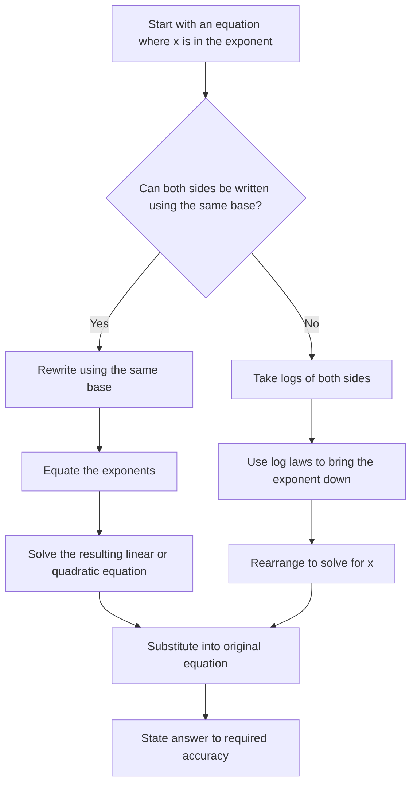
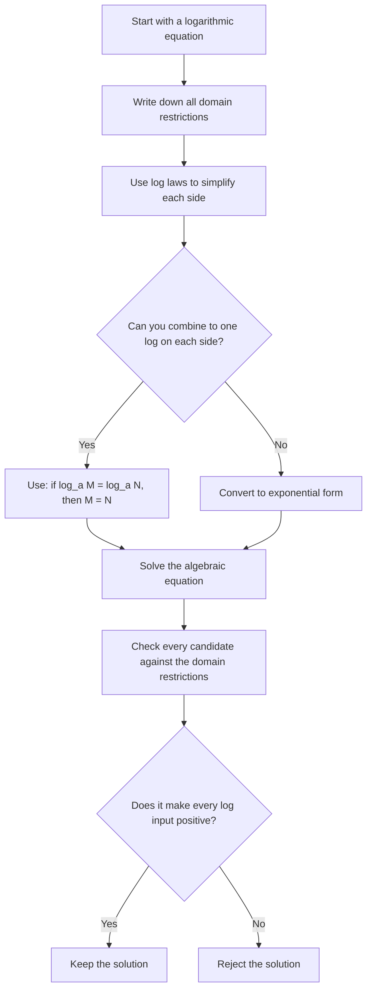
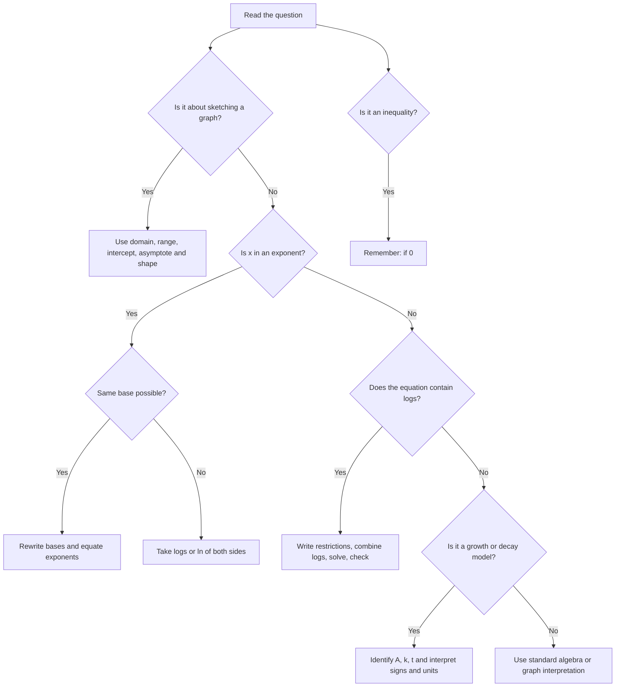

# Mermaid Diagrams for AS1 Exponentials and Logarithms

## MMD-001: Exponentials and logarithms concept map
Source: lesson PDF p.3 and p.8  
Used in lesson placeholder: `[VISUAL PLACEHOLDER: MMD-001 | Source: lesson PDF p.3 and p.8 | Insert from AS1_exponentials_and_logarithms_mermaid.md | Purpose: concept map linking exponentials, logarithms, inverse functions and domain restrictions]`  
Purpose: Shows that logarithms are inverse functions of exponentials and that the restrictions on bases and inputs are essential.

```mermaid
flowchart LR
    A[Exponential function y = a^x] --> B[Base a is positive]
    B --> C[a cannot equal 1]
    A --> D[Domain: all real x]
    A --> E[Range: y > 0]
    A --> F[Always passes through (0,1)]
    A --> G[Inverse function]
    G --> H[Logarithm y = log_a x]
    H --> I[Input x must be positive]
    H --> J[Domain: x > 0]
    H --> K[Range: all real y]
    H --> L[log_a n = x means a^x = n]
    M[Natural case] --> N[y = e^x]
    N --> O[Inverse is y = ln x]
    O --> I
```

---

## MMD-002: Solving exponential equations
Source: lesson PDF p.6  
Used in lesson placeholder: `[VISUAL PLACEHOLDER: MMD-002 | Source: lesson PDF p.6 | Insert from AS1_exponentials_and_logarithms_mermaid.md | Purpose: flowchart for solving exponential equations]`  
Purpose: Gives a reliable written method for equations where the unknown is in an exponent.



---

## MMD-003: Solving logarithmic equations
Source: lesson PDF p.7  
Used in lesson placeholder: `[VISUAL PLACEHOLDER: MMD-003 | Source: lesson PDF p.7 | Insert from AS1_exponentials_and_logarithms_mermaid.md | Purpose: method flowchart for solving logarithmic equations with domain checks]`  
Purpose: Emphasises the domain check, which is the most common source of lost marks in logarithm equations.



---

## MMD-004: Method decision tree for exponential and logarithmic questions
Source: AI-proposed teaching enhancement, not present in lesson PDF  
Used in lesson placeholder: `[VISUAL PLACEHOLDER: MMD-004 | Source: AI-proposed teaching enhancement, not present in lesson PDF | Insert from AS1_exponentials_and_logarithms_mermaid.md | Purpose: decision tree for choosing a solution method for exponential/log equations and inequalities]`  
Purpose: Helps an independent learner decide which method to use before starting algebra.



---

## MMD-005: Exponential modelling workflow
Source: lesson PDF p.10  
Used in lesson placeholder: `[VISUAL PLACEHOLDER: MMD-005 | Source: lesson PDF p.10 | Insert from AS1_exponentials_and_logarithms_mermaid.md | Purpose: workflow for using an exponential model]`  
Purpose: Summarises how to build, use and interpret a model of the form y = Ae^(kt).

```mermaid
flowchart TD
    A[Read the context] --> B[Identify the initial value A]
    B --> C[Decide whether k is positive or negative]
    C --> D[Write the model y = A e^(kt)]
    D --> E{Need a value at a given time?}
    E -- Yes --> F[Substitute t and calculate y]
    E -- No --> G{Need time for a given value?}
    G -- Yes --> H[Substitute y, divide by A, take ln, solve for t]
    G -- No --> I[Interpret the model]
    F --> I
    H --> I
    I --> J[Check units, rounding and whether prediction is realistic]
```
