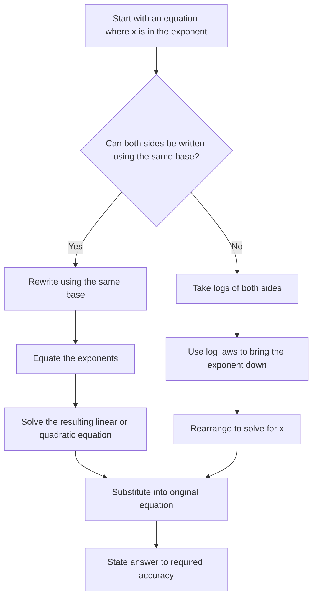
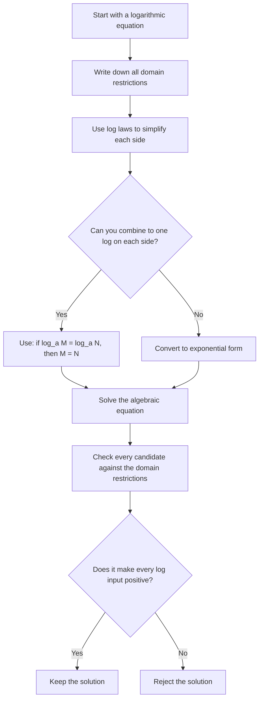
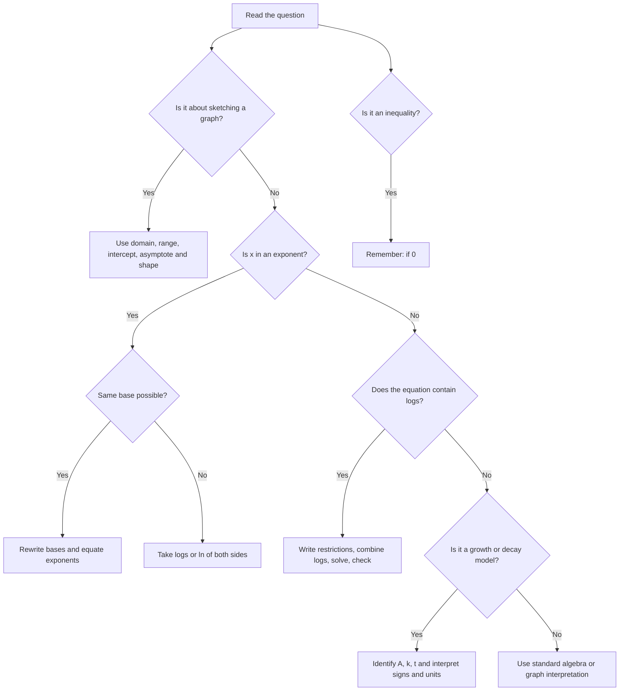

# AS1 Exponentials and Logarithms Lesson Agent Source

## 0. AI-Agent Usage Instructions

This file is a source for teaching, revision, explanation, diagnostics and lesson retrieval. Core lesson content is in Section 5. Diagram assets are in Section 6. Widgets are in Section 7. Use the lesson content before generated enhancement notes. Do not claim AI-proposed assets came from the original PDF. Preserve syllabus gap notes and uncertainty notes. Use UK/CCEA mathematical vocabulary.

## 1. Pack Metadata

```yaml
pack_type: lesson
unit_code: AS1
unit_name: CCEA AS1 Pure Mathematics
topic_slug: "07_expoentials_and_logarithms"
topic_title: "Exponentials and Logarithms"
source_folder: "/Users/evanward/Documents/AS Portal - New /AS1 Files/07. Expoentials & Logarithms"
output_file: "/Users/evanward/Documents/AS Portal - New /AS1 Files/00_AGENT_SOURCE_PACKS/07_expoentials_and_logarithms/AS1_exponentials_and_logarithms_agent_source.md"
created_from_files:
  lesson: "AS1_exponentials_and_logarithms_lesson.md"
  questions: null
  solutions: null
  mermaid: "AS1_exponentials_and_logarithms_mermaid.md"
  svg: "AS1_exponentials_and_logarithms_svg.md"
  tikz: "AS1_exponentials_and_logarithms_tikz.md"
  widgets: "AS1_exponentials_and_logarithms_widgets.md"
contains_lesson: true
contains_questions: false
contains_solutions: false
contains_mermaid: true
contains_svg: true
contains_tikz: true
contains_widgets: true
agent_use_cases:
  - teach topic
  - explain examples
  - retrieve definitions
  - retrieve diagrams
  - retrieve widgets
  - diagnose misconceptions
```

## 2. Source File Manifest

| Role | Source file | Lines | Bytes UTF-8 | SHA-256 |
|---|---|---:|---:|---|
| lesson | AS1_exponentials_and_logarithms_lesson.md | 1465 | 36912 | `0f4c9677d59c6eb8104a3ba7c5f7e87178b2007ed026a971bb7d68f15606545e` |
| mermaid | AS1_exponentials_and_logarithms_mermaid.md | 114 | 5058 | `e218dd3b9a503a66f88ebec390d9b8bd0a85d0879d2a53517accad7f8137596f` |
| svg | AS1_exponentials_and_logarithms_svg.md | 162 | 13784 | `f884fba2ed6ea209f50af323c3875f05a2269647c8099193e9aee2d9265d700b` |
| tikz | AS1_exponentials_and_logarithms_tikz.md | 266 | 8723 | `4e2468fbf03df3bd7110b1903b4d0aa941203c3d7cffc9ee77dfe84edf468bc1` |
| widgets | AS1_exponentials_and_logarithms_widgets.md | 430 | 18499 | `738362baa77607dd23a6ccd64e58f728a1705611de2f00625b6712c665343bbe` |

## 3. Preservation and Retrieval Map

- Original Markdown is preserved verbatim inside labelled source-content sections.
- Mathematical notation, source labels, question IDs, pack IDs, visual placeholders, code blocks and generated/AI-proposed labels are retained.
- Diagram and widget files are separated by asset type so an AI agent can retrieve them without confusing them with explanatory prose.
- Audit details, warnings, file checksums and ID checks are stored in the companion audit file.

## 4. Source Navigation and Pack Boundaries

- Section 5 contains the core lesson Markdown.
- Section 6 contains Mermaid, SVG and TikZ visual assets in that order.
- Section 7 contains widget/HTML/CSS/JavaScript assets.
- Section 8 gives retrieval notes for downstream AI agents.
- Missing optional/expected roles: questions, solutions

## 5. Core Lesson Content

### Source File Metadata

```yaml
filename: "AS1_exponentials_and_logarithms_lesson.md"
absolute_path: "/Users/evanward/Documents/AS Portal - New /AS1 Files/07. Expoentials & Logarithms/AS1_exponentials_and_logarithms_lesson.md"
lines: 1465
bytes_utf8: 36912
sha256: "0f4c9677d59c6eb8104a3ba7c5f7e87178b2007ed026a971bb7d68f15606545e"
```

### Preserved Source Content: AS1_exponentials_and_logarithms_lesson.md

# CCEA AS1 Pure Mathematics Lesson: Exponentials and Logarithms

**Unit:** CCEA AS1 Pure Mathematics  
**Source lesson PDF:** `EXPONENTIALS AND LOGARITHMS .pdf`  
**Specification sources:** `Specification(10).pdf`, `Elaboration Document(10).pdf`  
**Date generated:** 22 May 2026

This lesson pack is written for independent study from Higher Tier GCSE knowledge. It follows the uploaded CCEA Specification and Elaboration Document first, then uses the lesson PDF as the main teaching source. Where the lesson PDF contains numerical slips, the worked answers below use corrected mathematics and clearly say so.

---

## 2. Specification Alignment

| CCEA spec point | Elaboration guidance | Covered? | Notes location | Gap/action | Visual/widget support |
|---|---|---:|---|---|---|
| $a^x$ and graph, $a>0$ | Compare $a>1$ and $0<a<1$ | Yes | 7.1, 8, 10 | None | TIKZ-001, WIDGET-001 |
| $e^x$ and graph | Simple transformations | Yes | 7.2, 7.11 | Added compact transformations | TIKZ-002 |
| $\log_a x$ inverse of $a^x$ | $a>0$, $a\ne1$ | Yes | 7.3, 10 | None | MMD-001, TIKZ-003 |
| $\ln x$ and graph | Inverse of $e^x$ | Yes | 7.4, 10 | None | TIKZ-004 |
| Laws of logarithms | Prove and use | Yes | 7.5, 10 | Proof added | SVG-001 |
| Exponential equations | $a^x=b$ type | Yes | 7.6, 10 | Corrected PDF slips | MMD-002, WIDGET-002 |
| Exponential inequalities | e.g. $a^x<b$ | Yes | 7.7, 12, 13 | Added from spec | MMD-004 |
| Log equations | Check domains | Yes | 7.8, 10 | Corrected PDF slips | MMD-003 |
| Quadratic in a function | Includes exponentials/logs | Yes | 7.9, 10 | Reframed on-spec | TIKZ-006 |
| Growth and decay | Interest, population, decay, drugs | Yes | 7.10, 10 | None | SVG-002, TIKZ-007, WIDGET-003 |
| Technology use | Graphing tools; no CAS in exams | Yes | 9, 14 | Widgets as learning tools | All widgets |
| Straightening curves | Not named in AS1 | Extension | 15 | Excluded from core | TIKZ-008, SVG-004 |

---

## 3. Learning Objectives

By the end of this lesson, you should be able to:

- recognise and sketch exponential graphs of the form $y=a^x$;
- explain the difference between powers such as $x^a$ and exponential functions such as $a^x$;
- use the special exponential function $y=e^x$ and understand why it is important;
- convert between exponential form and logarithmic form;
- state the domain and range of $a^x$, $e^x$, $\log_a x$ and $\ln x$;
- use and prove the three main laws of logarithms;
- solve exponential equations by taking logarithms;
- solve logarithmic equations while checking domain restrictions;
- solve exponential inequalities, including the case where $0<a<1$;
- solve simple quadratic equations in an exponential or logarithmic expression by substitution;
- use exponential models of the form $y=Ae^{kt}$ for growth and decay;
- explain how technology can support learning while still showing exam-suitable written methods.

---

## 4. Compact Prerequisite Recap

### Indices

You should already know:

$$a^m a^n=a^{m+n}, \qquad \frac{a^m}{a^n}=a^{m-n}, \qquad (a^m)^n=a^{mn}.$$

Also:

$$a^0=1,\qquad a^{-n}=\frac{1}{a^n},\qquad a^{1/2}=\sqrt a.$$

**Quick examples**

$$2^3=8,\qquad 2^{-3}=\frac18,\qquad 9^{1/2}=3.$$

### Graph vocabulary

- The **domain** is the set of allowed input values.
- The **range** is the set of possible output values.
- An **asymptote** is a line a graph approaches but does not meet in the limiting direction.
- An **inverse function** reverses the action of another function.

### GCSE algebra reminder

If you solve an equation by squaring, substituting, or taking logs, you should check the answer in the original equation. This matters a lot in logarithm questions because logarithms only accept positive inputs.

---

## 5. Big Picture Explanation

An exponential function has the variable in the power, for example $2^x$, $3^x$ or $e^x$. These functions model repeated multiplication, rapid growth, and decay towards zero. In AS1, exponential functions appear in graphs, equations, inequalities and modelling.

A logarithm answers the reverse question. If $2^3=8$, then $\log_2 8=3$. So logarithms are the inverse operation to exponentials. This is why logarithms are the tool we use when the unknown is trapped in an exponent.

This topic is exam-important because questions often mix several skills: interpreting a graph, using log laws, solving equations, checking restrictions, and explaining model parameters in context.

---

## 6. Key Definitions and Notation

### Exponential function

An exponential function has the form

$$y=a^x,$$

where $a>0$ and $a\ne1$. The base $a$ is constant and the variable is the exponent.

### Euler's number

Euler's number is

$$e\approx2.71828.$$

The function $e^x$ is special because, in later calculus work,

$$\frac{d}{dx}(e^x)=e^x.$$

This makes it the natural function for continuous growth and decay.

### Logarithm

For $a>0$, $a\ne1$ and $n>0$,

$$\log_a n=x \quad \Longleftrightarrow \quad a^x=n.$$

In words: $\log_a n$ is the power to which $a$ must be raised to get $n$.

### Natural logarithm

The natural logarithm is the logarithm with base $e$:

$$\ln x=\log_e x.$$

It is the inverse of $e^x$:

$$\ln(e^x)=x,\qquad e^{\ln x}=x \quad (x>0).$$

### Arguments and bases

In $\log_a x$:

- $a$ is the **base**;
- $x$ is the **argument** or input;
- the restrictions are $a>0$, $a\ne1$, and $x>0$.

---

## 7. Core Theory

### 7.1 Exponential graphs: $y=a^x$

For $y=a^x$, where $a>0$ and $a\ne1$:

- the domain is all real numbers;
- the range is $y>0$;
- the graph always passes through $(0,1)$ because $a^0=1$;
- the horizontal asymptote is $y=0$;
- if $a>1$, the graph is increasing;
- if $0<a<1$, the graph is decreasing.

For example, $y=2^x$ has these values:

| $x$ | $-2$ | $-1$ | $0$ | $1$ | $2$ | $3$ | $4$ |
|---:|---:|---:|---:|---:|---:|---:|---:|
| $2^x$ | $\frac14$ | $\frac12$ | $1$ | $2$ | $4$ | $8$ | $16$ |

Each time $x$ increases by $1$, the value is multiplied by the base.

[VISUAL PLACEHOLDER: TIKZ-001 | Source: lesson PDF p.1 | Insert from AS1_exponentials_and_logarithms_tikz.md | Purpose: compare exponential graph shapes for different bases]

[INTERACTIVE PLACEHOLDER: WIDGET-001 | Source: AI-proposed teaching enhancement, not present in lesson PDF | Insert from AS1_exponentials_and_logarithms_widgets.md | Purpose: slider exploration of $y=a^x$ and its inverse $y=\log_a x$]

**Common mistake:** Do not confuse $x^a$ with $a^x$. In $x^a$, the variable is the base. In $a^x$, the variable is the exponent.

---

### 7.2 Euler's number and $y=e^x$

The function $y=e^x$ is an increasing exponential graph with:

- domain: all real numbers;
- range: $y>0$;
- horizontal asymptote: $y=0$;
- point $(0,1)$;
- the special calculus property $\frac{d}{dx}(e^x)=e^x$.

[VISUAL PLACEHOLDER: TIKZ-002 | Source: lesson PDF p.2 | Insert from AS1_exponentials_and_logarithms_tikz.md | Purpose: compare $e^x$ with $2^x$ and $3^x$]

The derivative fact is not needed to differentiate in AS1, but it explains why $e^x$ appears naturally in continuous growth and decay models.

**Warning:** $e$ is a number, not a variable. On a calculator, use the exponential key, often shown as `exp` or $e^x$.

---

### 7.3 Logarithms as inverses

A logarithm reverses an exponential. The defining relationship is:

$$\log_a n=x \quad \Longleftrightarrow \quad a^x=n.$$

Examples:

| Exponential form | Logarithmic form | Meaning |
|---|---|---|
| $3^2=9$ | $\log_3 9=2$ | Power of $3$ giving $9$ |
| $2^3=8$ | $\log_2 8=3$ | Power of $2$ giving $8$ |
| $5^0=1$ | $\log_5 1=0$ | Power of $5$ giving $1$ |
| $64^{1/2}=8$ | $\log_{64}8=\frac12$ | Power of $64$ giving $8$ |

[VISUAL PLACEHOLDER: MMD-001 | Source: lesson PDF p.3 and p.8 | Insert from AS1_exponentials_and_logarithms_mermaid.md | Purpose: concept map linking exponentials, logarithms, inverse functions and domain restrictions]

[VISUAL PLACEHOLDER: TIKZ-003 | Source: lesson PDF p.3 | Insert from AS1_exponentials_and_logarithms_tikz.md | Purpose: show $y=2^x$ and $y=\log_2x$ as reflections in $y=x$]

**Restriction:** $\log_a x$ is defined only when $a>0$, $a\ne1$, and $x>0$.

---

### 7.4 Natural logarithms and $y=\ln x$

Natural logarithms use base $e$:

$$\ln x=\log_e x.$$

The key identities are:

$$\ln 1=0,\qquad \ln e=1,\qquad \ln(e^x)=x,\qquad e^{\ln x}=x \ (x>0).$$

The graph of $y=\ln x$ has:

- domain: $x>0$;
- range: all real numbers;
- vertical asymptote: $x=0$;
- point $(1,0)$;
- increasing shape;
- inverse relationship with $y=e^x$.

[VISUAL PLACEHOLDER: TIKZ-004 | Source: lesson PDF p.4 | Insert from AS1_exponentials_and_logarithms_tikz.md | Purpose: graph of $y=\ln x$ with domain, range and asymptote]

**Common mistake:** $\ln x$ is not defined for $x\le0$. For example, $\ln(-3)$ is not a real number.

---

### 7.5 Laws of logarithms

For $a>0$, $a\ne1$, $x>0$, $y>0$, and real $k$:

$$\log_a x+\log_a y=\log_a(xy),$$

$$\log_a x-\log_a y=\log_a\left(\frac{x}{y}\right),$$

$$k\log_a x=\log_a(x^k).$$

[VISUAL PLACEHOLDER: SVG-001 | Source: lesson PDF p.5 | Insert from AS1_exponentials_and_logarithms_svg.md | Purpose: quick-reference card for log laws, special cases and restrictions]

#### Short proof of the product law

Let

$$\log_a x=m,\qquad \log_a y=n.$$

Then

$$a^m=x,\qquad a^n=y.$$

Multiplying gives

$$xy=a^m a^n=a^{m+n}.$$

Therefore

$$\log_a(xy)=m+n=\log_a x+\log_a y.$$

The quotient and power laws can be proved in a similar way using index laws.

#### Special cases

$$\log_a a=1,$$

$$\log_a 1=0,$$

$$\log_a\left(\frac1x\right)=-\log_a x,$$

$$\log_a(a^k)=k.$$

#### Change of base

Calculators usually use $\ln$ or $\log_{10}$. To calculate a log with another base:

$$\log_a x=\frac{\ln x}{\ln a}.$$

For example:

$$\log_8 20=\frac{\ln 20}{\ln 8}.$$

**Warning:** You cannot split $\log_a(x+y)$ into $\log_a x+\log_a y$. Log laws work with products, quotients and powers, not sums.

---

### 7.6 Solving exponential equations

When the unknown is in the exponent, take logarithms of both sides.

[VISUAL PLACEHOLDER: MMD-002 | Source: lesson PDF p.6 | Insert from AS1_exponentials_and_logarithms_mermaid.md | Purpose: flowchart for solving exponential equations]

Example:

$$3^x=20.$$

Take $\ln$ of both sides:

$$\ln(3^x)=\ln20.$$

Use $\ln(a^x)=x\ln a$:

$$x\ln3=\ln20.$$

So

$$x=\frac{\ln20}{\ln3}\approx2.73.$$

[INTERACTIVE PLACEHOLDER: WIDGET-002 | Source: lesson PDF p.6, adapted and corrected | Insert from AS1_exponentials_and_logarithms_widgets.md | Purpose: practise solving $a^{mx+c}=b$ and checking by substitution]

**Exam method:** Show the step where you take logarithms. Then show the log law. Then solve for $x$.

---

### 7.7 Solving exponential inequalities

The CCEA specification includes inequalities involving exponential functions. The lesson PDF does not give a full section on this, so this is added to complete the AS1 content.

#### Case 1: base greater than 1

If $a>1$, then $a^x$ is increasing. The inequality direction stays the same when comparing exponents.

Example:

$$3^{2x+1}<27.$$

Since $27=3^3$,

$$3^{2x+1}<3^3.$$

Because $3^x$ is increasing,

$$2x+1<3,$$

so

$$x<1.$$

#### Case 2: base between 0 and 1

If $0<a<1$, then $a^x$ is decreasing. The inequality direction reverses when comparing exponents.

Example:

$$\left(\frac12\right)^x<\frac18.$$

Since $\frac18=\left(\frac12\right)^3$,

$$\left(\frac12\right)^x<\left(\frac12\right)^3.$$

Because the base is between $0$ and $1$, the function is decreasing, so

$$x>3.$$

[VISUAL PLACEHOLDER: MMD-004 | Source: AI-proposed teaching enhancement, not present in lesson PDF | Insert from AS1_exponentials_and_logarithms_mermaid.md | Purpose: decision tree for choosing a solution method for exponential/log equations and inequalities]

**Common mistake:** When $0<a<1$, do not forget to reverse the inequality direction.

---

### 7.8 Solving logarithmic equations

A logarithmic equation contains logarithms of expressions. The main strategy is:

1. simplify using log laws;
2. combine logs into one log if possible;
3. convert to exponential form;
4. solve the resulting algebraic equation;
5. check that every log argument is positive in the original equation.

[VISUAL PLACEHOLDER: MMD-003 | Source: lesson PDF p.7 | Insert from AS1_exponentials_and_logarithms_mermaid.md | Purpose: method flowchart for solving logarithmic equations with domain checks]

Example:

$$\log_{10}4+2\log_{10}x=2.$$

Use the power law:

$$\log_{10}4+\log_{10}x^2=2.$$

Combine logs:

$$\log_{10}(4x^2)=2.$$

Convert to exponential form:

$$4x^2=10^2=100.$$

Solve:

$$x^2=25,$$

so

$$x=\pm5.$$

Check the original domain: $\log_{10}x$ needs $x>0$, so reject $x=-5$.

Final answer:

$$x=5.$$

---

### 7.9 Quadratic equations in exponential or logarithmic functions

The CCEA Elaboration Document says AS1 questions may include quadratic equations in a function of the unknown, including exponential and logarithmic functions. The clean on-spec method is to substitute for the repeated expression.

Example:

$$e^{2x}-5e^x+6=0.$$

Since $e^{2x}=(e^x)^2$, let

$$u=e^x.$$

Then

$$u^2-5u+6=0.$$

Factorise:

$$(u-2)(u-3)=0.$$

So

$$u=2 \quad \text{or} \quad u=3.$$

Back-substitute:

$$e^x=2 \quad \text{or} \quad e^x=3.$$

Therefore

$$x=\ln2 \quad \text{or} \quad x=\ln3.$$

[VISUAL PLACEHOLDER: TIKZ-006 | Source: lesson PDF p.9, corrected and reframed for CCEA AS1 | Insert from AS1_exponentials_and_logarithms_tikz.md | Purpose: show intersection idea behind exponential equations while warning that graph/numerical checks may be needed]

**Important correction:** The lesson PDF p.9 uses examples such as $x^2+2x=5^x$. Those are not true quadratic-in-a-function equations after substitution, and several printed answers are not correct. The on-spec version above is the reliable AS1 method.

---

### 7.10 Exponential growth and decay models

The standard continuous exponential model is

$$y=Ae^{kt},$$

where:

- $A$ is the initial value, because $y(0)=Ae^0=A$;
- $k$ is the growth or decay constant;
- $t$ is time or another continuous variable;
- $y$ is the modelled quantity.

[VISUAL PLACEHOLDER: SVG-002 | Source: lesson PDF p.10 | Insert from AS1_exponentials_and_logarithms_svg.md | Purpose: parameter card for $y=Ae^{kt}$]

[VISUAL PLACEHOLDER: TIKZ-007 | Source: lesson PDF p.10 | Insert from AS1_exponentials_and_logarithms_tikz.md | Purpose: compare growth and decay curves for $y=Ae^{kt}$]

If $k>0$, the model shows growth. If $k<0$, the model shows decay.

The rate of change is proportional to the current value:

$$\frac{dy}{dt}=kAe^{kt}=ky.$$

[VISUAL PLACEHOLDER: MMD-005 | Source: lesson PDF p.10 | Insert from AS1_exponentials_and_logarithms_mermaid.md | Purpose: workflow for using an exponential model]

[INTERACTIVE PLACEHOLDER: WIDGET-003 | Source: AI-proposed teaching enhancement based on lesson PDF p.10 | Insert from AS1_exponentials_and_logarithms_widgets.md | Purpose: explore $y=Ae^{kt}$, current value, rate of change and half-life/doubling time]

#### Finding $k$ from two data points

If

$$y_1=Ae^{kt_1},\qquad y_2=Ae^{kt_2},$$

then dividing gives

$$\frac{y_2}{y_1}=e^{k(t_2-t_1)}.$$

Taking natural logs gives

$$\ln\left(\frac{y_2}{y_1}\right)=k(t_2-t_1),$$

so

$$k=\frac{\ln(y_2/y_1)}{t_2-t_1}.$$

**Modelling warning:** Check units. If $t$ is in years, then $k$ is per year. If $t$ is in months, then $k$ is per month.

---

### 7.11 Simple transformations of exponential and logarithmic graphs

The Elaboration Document mentions simple transformations for $e^x$ and $\ln x$. A compact AS1 summary is:

- $y=e^x+k$ shifts $e^x$ vertically by $k$; the horizontal asymptote becomes $y=k$.
- $y=e^{x-h}$ shifts $e^x$ right by $h$.
- $y=\ln(x-h)$ shifts $\ln x$ right by $h$; the vertical asymptote becomes $x=h$.
- $y=\ln x+k$ shifts $\ln x$ vertically by $k$.

Example:

$$y=\ln(x-3)$$

has domain $x>3$ and vertical asymptote $x=3$.

---

### 7.12 Optional extension from the lesson PDF: straightening curves with logs

The lesson PDF p.11 covers straightening curves with logs. This is useful enrichment, but it is not named as a core CCEA AS1 objective in the uploaded AS1 exponentials and logarithms section. The exponential model part,

$$y=Ae^{kx}\quad \Rightarrow \quad \ln y=kx+\ln A,$$

supports modelling and log laws. The power-law part,

$$y=ax^n\quad \Rightarrow \quad \log y=n\log x+\log a,$$

is treated here as extension only.

[VISUAL PLACEHOLDER: TIKZ-008 | Source: lesson PDF p.11 | Insert from AS1_exponentials_and_logarithms_tikz.md | Purpose: optional extension showing how log plots can turn some curved relationships into straight lines]

[VISUAL PLACEHOLDER: SVG-004 | Source: lesson PDF p.11 | Insert from AS1_exponentials_and_logarithms_svg.md | Purpose: optional extension summary for recovering parameters from straightened log plots]

---

## 8. Visual Asset Integration

The lesson PDF contains many visual summaries, graphs, formula cards, and method boxes. The high-value assets have been rebuilt as code rather than copied as images.

| Asset ID | Source | Purpose |
|---|---|---|
| TIKZ-001 | PDF p.1 | Exponential base comparison |
| TIKZ-002 | PDF p.2 | $e^x$ compared with $2^x,3^x$ |
| TIKZ-003 | PDF p.3 | Exponential/log inverse reflection |
| TIKZ-004 | PDF p.4 | $y=\ln x$ graph |
| SVG-001 | PDF p.5 | Log laws formula card |
| MMD-002 | PDF p.6 | Exponential equation method |
| MMD-003 | PDF p.7 | Log equation method |
| TIKZ-005 | PDF p.8 | Log graph base comparison |
| TIKZ-006 | PDF p.9 | Corrected equation-intersection view |
| SVG-002 | PDF p.10 | Exponential model parameters |
| TIKZ-007 | PDF p.10 | Growth versus decay |
| TIKZ-008 | PDF p.11 | Optional log-linearisation extension |

[VISUAL PLACEHOLDER: TIKZ-005 | Source: lesson PDF p.8 | Insert from AS1_exponentials_and_logarithms_tikz.md | Purpose: compare logarithmic graphs for bases greater than 1 and between 0 and 1]

[VISUAL PLACEHOLDER: SVG-003 | Source: AI-proposed teaching enhancement, not present in lesson PDF | Insert from AS1_exponentials_and_logarithms_svg.md | Purpose: compact domain-and-method warning card for independent study]

The AI-proposed SVG-003 was added because many errors in logarithm questions come from ignoring restrictions such as $x>0$ or forgetting that a decreasing exponential reverses inequalities.

---

## 9. Interactive Learning Widgets

The widgets are learning aids. They are not a replacement for written exam working.

### Widget 1: Exponential and logarithm inverse explorer

[INTERACTIVE PLACEHOLDER: WIDGET-001 | Source: AI-proposed teaching enhancement, not present in lesson PDF | Insert from AS1_exponentials_and_logarithms_widgets.md | Purpose: slider exploration of $y=a^x$ and $y=\log_a x$]

You can change the base $a$. The graph updates to show both $y=a^x$ and $y=\log_a x$, with the reflection line $y=x$. Notice that both functions swap coordinates: if $(p,q)$ lies on $y=a^x$, then $(q,p)$ lies on $y=\log_a x$.

### Widget 2: Exponential equation checker

[INTERACTIVE PLACEHOLDER: WIDGET-002 | Source: lesson PDF p.6, adapted and corrected | Insert from AS1_exponentials_and_logarithms_widgets.md | Purpose: practise solving $a^{mx+c}=b$ and checking by substitution]

You can change $a$, $m$, $c$ and $b$ in $a^{mx+c}=b$. The widget updates the log step, the value of $x$, and a substitution check. This supports exam understanding because it shows why the formula

$$x=\frac{\ln b/\ln a-c}{m}$$

comes from taking logs, not from guessing.

### Widget 3: Growth and decay model explorer

[INTERACTIVE PLACEHOLDER: WIDGET-003 | Source: AI-proposed teaching enhancement based on lesson PDF p.10 | Insert from AS1_exponentials_and_logarithms_widgets.md | Purpose: explore $y=Ae^{kt}$, current value, rate of change and half-life/doubling time]

You can change $A$, $k$ and $t$. The output updates $y=Ae^{kt}$, the rate $dy/dt=ky$, and either a doubling time or half-life when it applies. This links to exam modelling because you must interpret $A$, $k$, units, and long-term behaviour.

To run each widget, copy the HTML code from the widget file into a `.html` file and open it in a browser.

---

## 10. Worked Examples

### Example 1: Sketching $y=2^x$

**Question:** Sketch $y=2^x$, giving key features.

**Method:** Use a small table and the standard exponential graph features.

| $x$ | $-2$ | $-1$ | $0$ | $1$ | $2$ |
|---:|---:|---:|---:|---:|---:|
| $2^x$ | $\frac14$ | $\frac12$ | $1$ | $2$ | $4$ |

The graph passes through $(0,1)$, is increasing, has range $y>0$, and has horizontal asymptote $y=0$.

**Exam technique:** Mark the intercept $(0,1)$ and asymptote $y=0$. Do not draw the curve crossing the $x$-axis.

---

### Example 2: Convert between log and exponential form

**Question:** Convert $\log_4 64=3$ into exponential form.

By definition,

$$\log_a n=x \Longleftrightarrow a^x=n.$$

So

$$\log_4 64=3 \Longleftrightarrow 4^3=64.$$

**Exam technique:** Read $\log_4 64=3$ as “$4$ to what power gives $64$?”

---

### Example 3: Solve an equation using $\ln$

**Question:** Solve $e^x=5$.

Take natural logs of both sides:

$$\ln(e^x)=\ln5.$$

Use $\ln(e^x)=x$:

$$x=\ln5.$$

So

$$x\approx1.609 \quad \text{(3 d.p.)}.$$

---

### Example 4: Solve $\ln(3x+1)=2$

**Question:** Solve $\ln(3x+1)=2$.

Convert to exponential form:

$$3x+1=e^2.$$

Then

$$3x=e^2-1,$$

so

$$x=\frac{e^2-1}{3}.$$

Using $e^2\approx7.389$,

$$x\approx\frac{6.389}{3}\approx2.130.$$

Check the domain:

$$3x+1>0 \Rightarrow x>-\frac13.$$

The solution $x\approx2.130$ is valid.

**Correction note:** The lesson PDF p.4 appears to print $2.195$ for this example. The corrected value is $2.130$ to 3 d.p.

---

### Example 5: Simplify a log expression

**Question:** Simplify

$$3\ln x+2\ln5-\ln(2x), \qquad x>0.$$

Use the power law:

$$3\ln x=\ln(x^3),\qquad 2\ln5=\ln(25).$$

So

$$3\ln x+2\ln5-\ln(2x)=\ln(x^3)+\ln(25)-\ln(2x).$$

Use product and quotient laws:

$$=\ln(25x^3)-\ln(2x)$$

$$=\ln\left(\frac{25x^3}{2x}\right).$$

Simplify the fraction:

$$=\ln\left(\frac{25x^2}{2}\right).$$

---

### Example 6: Solve an exponential equation

**Question:** Solve $5^{2x-1}=61$.

Take logs of both sides:

$$\log_5(5^{2x-1})=\log_5 61.$$

Use $\log_5(5^u)=u$:

$$2x-1=\log_5 61.$$

So

$$2x=\log_5 61+1,$$

and

$$x=\frac{\log_5 61+1}{2}.$$

Using a calculator,

$$x\approx1.78 \quad \text{(2 d.p.)}.$$

**Correction note:** The lesson PDF p.6 prints $0.89$. The corrected answer is $1.78$ to 2 d.p.

---

### Example 7: Solve a log equation with a domain check

**Question:** Solve

$$\log_2(x-1)+\log_2(x+3)=2.$$

First check the domain:

$$x-1>0 \Rightarrow x>1,$$

and

$$x+3>0 \Rightarrow x>-3.$$

So the combined domain is $x>1$.

Combine logs:

$$\log_2((x-1)(x+3))=2.$$

Convert to exponential form:

$$(x-1)(x+3)=2^2=4.$$

Expand and solve:

$$x^2+2x-3=4,$$

$$x^2+2x-7=0.$$

Use the quadratic formula:

$$x=\frac{-2\pm\sqrt{4+28}}{2}=\frac{-2\pm\sqrt{32}}{2}=-1\pm2\sqrt2.$$

Only $-1+2\sqrt2$ is greater than $1$.

Final answer:

$$x=-1+2\sqrt2\approx1.83.$$

---

### Example 8: Quadratic in $e^x$

**Question:** Solve

$$e^{2x}-4e^x+3=0.$$

Let $u=e^x$. Then $e^{2x}=u^2$, so

$$u^2-4u+3=0.$$

Factorise:

$$(u-1)(u-3)=0.$$

So

$$u=1 \quad \text{or} \quad u=3.$$

Back-substitute:

$$e^x=1 \Rightarrow x=0,$$

or

$$e^x=3 \Rightarrow x=\ln3.$$

Final answer:

$$x=0 \quad \text{or} \quad x=\ln3.$$

---

### Example 9: Exponential decay model

**Question:** A radioactive substance has mass

$$m=25e^{-0.05t},$$

where $t$ is measured in years. Find the initial mass, the mass after $6$ months, and the rate of change.

The initial mass is when $t=0$:

$$m=25e^{-0.05(0)}=25e^0=25.$$

So the initial mass is $25$ g.

Six months is $0.5$ years:

$$m=25e^{-0.05(0.5)}=25e^{-0.025}\approx24.38.$$

So the mass after six months is approximately $24.38$ g.

The rate of change is

$$\frac{dm}{dt}=k m=-0.05m.$$

So the mass is decreasing at a rate proportional to its current mass, with continuous decay constant $0.05$ per year.

---

## 11. Common Mistakes and Exam Traps

### Exponential graphs

- Drawing $y=a^x$ crossing the $x$-axis.
- Forgetting that every $y=a^x$ graph passes through $(0,1)$.
- Saying the range is all real numbers. It is $y>0$.

### Logarithms

- Forgetting $\log_a x$ requires $x>0$.
- Forgetting $a>0$ and $a\ne1$.
- Treating $\log_a(x+y)$ as $\log_a x+\log_a y$.
- Dropping the negative sign in the quotient law.
- Solving algebraically but keeping a value that makes a log argument non-positive.

### Exponential equations

- Taking logs of only one side.
- Writing $\ln(a^x)=a\ln x$. The correct rule is $\ln(a^x)=x\ln a$.
- Rounding too early.
- Not substituting the final answer back into the original equation.

### Exponential inequalities

- Forgetting to reverse the inequality when $0<a<1$.

### Modelling

- Confusing $A$ with $k$ in $y=Ae^{kt}$.
- Using months in one part of a question and years in another.
- Forgetting that $k<0$ means decay and $k>0$ means growth.
- Treating the widget or calculator result as a substitute for written reasoning.

---

## 12. Practice Questions

### A. Converting between forms

1. Express as logarithms:
   1. $5^4=625$
   2. $7^{-2}=\frac1{49}$
   3. $10^{1.5}=31.62\ldots$

2. Express as exponentials:
   1. $\log_4 64=3$
   2. $\log_2\left(\frac18\right)=-3$
   3. $\log_9 27=\frac32$

3. Simplify:
   1. $\log_3(3^x)$
   2. $3^{\log_3 x}$, where $x>0$
   3. $\log_a 1$
   4. $\log_a a$

### B. Laws of logarithms

4. Simplify:

$$\log_2 3+\log_2 5-\log_2 15.$$

5. Simplify, for $x>0$:

$$3\ln x+2\ln5-\ln(2x).$$

6. Simplify, for $a>0$, $a\ne1$, $x>0$:

$$2\log_a x-\log_a(x^4)+\log_a(a^3).$$

### C. Exponential equations

7. Solve $3^x=20$.

8. Solve $5^{2x-1}=61$.

9. Solve $e^{2x+1}=10$.

10. Solve $2^{x-2}=7^x$.

### D. Exponential inequalities

11. Solve $3^{2x+1}<27$.

12. Solve $\left(\frac12\right)^x<\frac18$.

13. Solve $e^{x-2}\ge5$.

### E. Logarithmic equations

14. Solve $\log_{10}4+2\log_{10}x=2$.

15. Solve $\log_2(x-1)+\log_2(x+3)=2$.

16. Solve $2\log_3 x-\log_3(x-2)=1$.

17. Solve $\log_5(x+1)=\log_5(2x-3)$.

18. Solve $\log_4(x+2)=1$.

19. Solve $\log_3(x^2-4x)=0$.

### F. Quadratic-in-a-function equations

20. Solve $e^{2x}-5e^x+6=0$.

21. Solve $4^x-5(2^x)+4=0$.

22. Solve $(\ln x)^2-3\ln x+2=0$, where $x>0$.

### G. Graphs

23. Sketch $y=\log_2 x$, showing where it crosses the $x$-axis and its vertical asymptote.

24. Is $y=\log_2 x$ increasing or decreasing?

25. State the domain and range of $y=\log_3 x$.

### H. Modelling

26. A quantity is modelled by $y=40e^{0.08t}$. State the initial value and whether the model shows growth or decay.

27. A drug concentration is modelled by $C=120e^{-0.3t}$, where $t$ is in hours. Find $C$ when $t=4$.

28. A population changes from $500$ to $620$ in $3$ years and is modelled by $P=Ae^{kt}$. Find $k$.

### I. Optional extension from PDF p.11

29. For the model $y=Ae^{kx}$, show that plotting $\ln y$ against $x$ gives a straight line.

30. If a straight-line plot of $\ln y$ against $x$ has gradient $0.35$ and intercept $-1.20$, write the model in the form $y=Ae^{kx}$.

---

## 13. Worked Solutions

### A. Converting between forms

1.  
   1. $5^4=625 \Rightarrow \log_5 625=4$.
   2. $7^{-2}=\frac1{49} \Rightarrow \log_7\left(\frac1{49}\right)=-2$.
   3. $10^{1.5}=31.62\ldots \Rightarrow \log_{10}(31.62\ldots)=1.5$.

2.  
   1. $\log_4 64=3 \Rightarrow 4^3=64$.
   2. $\log_2\left(\frac18\right)=-3 \Rightarrow 2^{-3}=\frac18$.
   3. $\log_9 27=\frac32 \Rightarrow 9^{3/2}=27$.

3.  
   1. $\log_3(3^x)=x$.
   2. $3^{\log_3 x}=x$ for $x>0$.
   3. $\log_a1=0$.
   4. $\log_a a=1$.

### B. Laws of logarithms

4.  

$$\log_2 3+\log_2 5-\log_2 15=\log_2(15)-\log_2(15)=\log_2 1=0.$$

5.  

$$3\ln x+2\ln5-\ln(2x)=\ln(x^3)+\ln(25)-\ln(2x)$$

$$=\ln\left(\frac{25x^3}{2x}\right)=\ln\left(\frac{25x^2}{2}\right).$$

6.  

$$2\log_a x-\log_a(x^4)+\log_a(a^3)$$

$$=\log_a(x^2)-\log_a(x^4)+3$$

$$=\log_a\left(\frac{x^2}{x^4}\right)+3$$

$$=\log_a(x^{-2})+3=-2\log_a x+3.$$

Equivalently,

$$3-2\log_a x=\log_a\left(\frac{a^3}{x^2}\right).$$

### C. Exponential equations

7.  

$$3^x=20.$$

Take logs:

$$x\ln3=\ln20.$$

So

$$x=\frac{\ln20}{\ln3}\approx2.73.$$

8.  

$$5^{2x-1}=61.$$

Take logs to base $5$:

$$2x-1=\log_5 61.$$

So

$$x=\frac{\log_5 61+1}{2}\approx1.78.$$

This is a corrected answer; the PDF p.6 answer is not numerically consistent with the equation shown.

9.  

$$e^{2x+1}=10.$$

Take $\ln$:

$$2x+1=\ln10.$$

So

$$x=\frac{\ln10-1}{2}\approx0.65.$$

10.  

$$2^{x-2}=7^x.$$

Take $\ln$:

$$(x-2)\ln2=x\ln7.$$

Rearrange:

$$x\ln2-2\ln2=x\ln7,$$

$$x(\ln2-\ln7)=2\ln2.$$

So

$$x=\frac{2\ln2}{\ln2-\ln7}\approx-1.11.$$

This is a corrected answer; the PDF p.6 printed value is not consistent with the equation shown.

### D. Exponential inequalities

11.  

$$3^{2x+1}<27=3^3.$$

Since $3>1$, compare exponents directly:

$$2x+1<3,$$

so

$$x<1.$$

12.  

$$\left(\frac12\right)^x<\frac18=\left(\frac12\right)^3.$$

Since $0<\frac12<1$, the function is decreasing, so reverse the exponent comparison:

$$x>3.$$

13.  

$$e^{x-2}\ge5.$$

Take $\ln$ of both sides. Since $e^x$ is increasing,

$$x-2\ge\ln5.$$

Therefore

$$x\ge2+\ln5.$$

### E. Logarithmic equations

14.  

$$\log_{10}4+2\log_{10}x=2.$$

Power law:

$$\log_{10}4+\log_{10}x^2=2.$$

Combine:

$$\log_{10}(4x^2)=2.$$

Convert:

$$4x^2=100.$$

So $x=\pm5$. Domain requires $x>0$, so

$$x=5.$$

15.  

As in Example 7:

$$x=-1+2\sqrt2.$$

16.  

Domain: $x>2$.

$$2\log_3x-\log_3(x-2)=1.$$

Use power and quotient laws:

$$\log_3\left(\frac{x^2}{x-2}\right)=1.$$

Convert:

$$\frac{x^2}{x-2}=3.$$

So

$$x^2=3x-6,$$

$$x^2-3x+6=0.$$

The discriminant is

$$(-3)^2-4(1)(6)=9-24=-15<0.$$

There is no real solution.

17.  

Since the bases are the same:

$$x+1=2x-3.$$

So

$$x=4.$$

Domain check: $x+1>0$ and $2x-3>0$, so $x=4$ is valid.

18.  

$$\log_4(x+2)=1 \Rightarrow x+2=4^1=4.$$

So

$$x=2.$$

Domain: $x+2>0$, so $x>-2$. The solution is valid.

19.  

$$\log_3(x^2-4x)=0.$$

Convert to exponential form:

$$x^2-4x=3^0=1.$$

So

$$x^2-4x-1=0.$$

Using the quadratic formula:

$$x=\frac{4\pm\sqrt{16+4}}{2}=2\pm\sqrt5.$$

Both make $x^2-4x=1>0$, so both are valid:

$$x=2+\sqrt5 \quad \text{or} \quad x=2-\sqrt5.$$

This corrects the PDF p.7 mini-check answer box, which is inconsistent with the question shown.

### F. Quadratic-in-a-function equations

20.  

Let $u=e^x$. Then

$$e^{2x}-5e^x+6=0 \Rightarrow u^2-5u+6=0.$$

Factorise:

$$(u-2)(u-3)=0.$$

So $u=2$ or $u=3$.

Back-substitute:

$$e^x=2 \Rightarrow x=\ln2,$$

$$e^x=3 \Rightarrow x=\ln3.$$

21.  

Since $4^x=(2^2)^x=2^{2x}=(2^x)^2$, let $u=2^x$.

Then

$$u^2-5u+4=0.$$

Factorise:

$$(u-1)(u-4)=0.$$

So

$$u=1 \quad \text{or} \quad u=4.$$

Back-substitute:

$$2^x=1 \Rightarrow x=0,$$

$$2^x=4 \Rightarrow x=2.$$

22.  

Let $u=\ln x$.

Then

$$u^2-3u+2=0.$$

Factorise:

$$(u-1)(u-2)=0.$$

So

$$u=1 \quad \text{or} \quad u=2.$$

Back-substitute:

$$\ln x=1 \Rightarrow x=e,$$

$$\ln x=2 \Rightarrow x=e^2.$$

Both are valid because $x>0$.

### G. Graphs

23.  

The graph of $y=\log_2x$ crosses the $x$-axis at $(1,0)$ because $\log_2 1=0$. It has vertical asymptote $x=0$ and domain $x>0$.

24.  

$y=\log_2x$ is increasing because the base $2$ is greater than $1$.

25.  

For $y=\log_3x$, the domain is $x>0$ and the range is all real numbers.

### H. Modelling

26.  

For

$$y=40e^{0.08t},$$

$A=40$, so the initial value is $40$. Since $k=0.08>0$, the model shows growth.

27.  

$$C=120e^{-0.3(4)}=120e^{-1.2}\approx36.14.$$

So the concentration is approximately $36.14$ in the given units.

28.  

Use

$$k=\frac{\ln(y_2/y_1)}{t_2-t_1}.$$

Here $y_1=500$, $y_2=620$, and $t_2-t_1=3$:

$$k=\frac{\ln(620/500)}{3}=\frac{\ln(1.24)}{3}\approx0.0718.$$

So $k\approx0.0718$ per year.

### I. Optional extension

29.  

Starting with

$$y=Ae^{kx},$$

take natural logs:

$$\ln y=\ln(Ae^{kx}).$$

Use the product law:

$$\ln y=\ln A+\ln(e^{kx}).$$

Since $\ln(e^{kx})=kx$,

$$\ln y=kx+\ln A.$$

This has the straight-line form $Y=mx+c$ if $Y=\ln y$, with gradient $k$ and intercept $\ln A$.

30.  

For a plot of $\ln y$ against $x$,

$$\ln y=kx+\ln A.$$

The gradient is $k$, so

$$k=0.35.$$

The intercept is $\ln A=-1.20$, so

$$A=e^{-1.20}\approx0.301.$$

Therefore

$$y\approx0.301e^{0.35x}.$$

---

## 14. Exam Technique Notes

CCEA AS1 questions on this topic may test routine skills and problem-solving in the same question.

### What examiners are looking for

- Correct use of domain restrictions for logarithms.
- Clear conversion between exponential and logarithmic form.
- Correct application of log laws.
- A complete method for solving equations, not just a calculator value.
- Correct interpretation of $A$ and $k$ in $y=Ae^{kt}$.
- Appropriate checking of solutions in the original equation.

### How to present working clearly

For exponential equations, write:

$$a^{mx+c}=b$$

then

$$(mx+c)\ln a=\ln b.$$

For logarithmic equations, write the domain restrictions before or immediately after solving. If a candidate value breaks the domain, reject it clearly.

### Calculator considerations

A calculator is useful for numerical values such as $\ln5$ or $e^{-0.025}$. However, in written working, show exact forms first where possible. For example:

$$x=\frac{\ln20}{\ln3}$$

is better than writing only $x=2.73$.

### Widget and technology use

The widgets help you see patterns and check numerical results. In an exam, you still need to show algebraic steps. Technology should support understanding, not replace reasoning.

---

## 15. Syllabus Gap Check

### Fully covered content

- $a^x$ and its graph.
- $e^x$ and its graph.
- $\log_a x$ as the inverse of $a^x$.
- $\ln x$ as the inverse of $e^x$.
- Log laws, including a proof of the product law.
- Solving exponential equations.
- Solving logarithmic equations.
- Exponential growth and decay models.

### Partially covered in the PDF, completed here

- Exponential inequalities were not properly developed in the PDF, so a full AS1 section was added.
- Simple transformations of $e^x$ and $\ln x$ were only implicit, so a compact section was added.
- Quadratics in exponential/log functions were reframed to match the CCEA Elaboration Document.

### Missing or corrected content

Several numerical answers in the lesson PDF appear inconsistent with their displayed equations. Corrected values are used in this pack, especially in:

- PDF p.4: $\ln(3x+1)=2$;
- PDF p.5: $\log_3x+2\log_3(x-1)=3$;
- PDF p.6: $5^{2x-1}=61$ and $2^{x-2}=7^x$;
- PDF p.7: the mini-check answer box;
- PDF p.9: pseudo-quadratic worked examples.

### Off-spec or extension content found but excluded from the core

- Full straightening of curves with logs, especially the power-law model $y=ax^n$, is treated as optional extension rather than core AS1.
- Graphical/numerical solution of equations such as $x^2+2x=5^x$ is not taught as the main AS1 pseudo-quadratic method because it is not the clean CCEA “quadratic in a function of the unknown” form.

### Assumptions made

- The default unit is AS1 Pure Mathematics.
- Calculator values are rounded only at the final step unless otherwise stated.
- All logs are real-valued logs, so log arguments must be positive.

---

## 16. Recommended Enhancements Not in the PDF

| Asset ID | Type | Why added | Spec support | Need |
|---|---|---|---|---|
| WIDGET-001 | Widget | Show inverse relationship dynamically | $a^x$, $\log_a x$ | Optional |
| WIDGET-002 | Widget | Practise log method and checking | Exponential equations | Optional |
| WIDGET-003 | Widget | Explore $A$, $k$, $t$ in models | Growth/decay | Optional |
| MMD-004 | Mermaid | Choose correct method | Equations/inequalities | Essential |
| SVG-003 | SVG | Prevent domain mistakes | Log restrictions | Essential |
| Added inequality section | Explanation | PDF gap | $a^x<b$ | Essential |
| Added transformation section | Explanation | PDF gap | Simple transformations | Essential |
| Corrected pseudo-quadratic section | Explanation | PDF issue | Quadratics in functions | Essential |

---

## 17. Supplementary Sources Used

No online supplementary sources were used. The pack is based on the uploaded CCEA Specification, uploaded CCEA Elaboration Document, and the uploaded lesson PDF.

---

## 18. Final Student Checklist

You should now be able to:

- sketch $y=a^x$, $y=e^x$, $y=\log_a x$ and $y=\ln x$;
- state domains, ranges and asymptotes correctly;
- convert between $a^x=n$ and $\log_a n=x$;
- use product, quotient and power laws for logarithms;
- prove at least one log law using index laws;
- solve exponential equations by taking logs;
- solve log equations and reject invalid solutions;
- solve simple exponential inequalities;
- use substitution for equations such as $e^{2x}-5e^x+6=0$;
- interpret $A$ and $k$ in $y=Ae^{kt}$;
- explain whether an exponential model shows growth or decay;
- use widgets/calculators to check understanding while still writing full exam working.

## 6. Diagram Assets

## 6.1 Mermaid Assets

### Source File Metadata

```yaml
filename: "AS1_exponentials_and_logarithms_mermaid.md"
absolute_path: "/Users/evanward/Documents/AS Portal - New /AS1 Files/07. Expoentials & Logarithms/AS1_exponentials_and_logarithms_mermaid.md"
lines: 114
bytes_utf8: 5058
sha256: "e218dd3b9a503a66f88ebec390d9b8bd0a85d0879d2a53517accad7f8137596f"
```

### Preserved Source Content: AS1_exponentials_and_logarithms_mermaid.md

# Mermaid Diagrams for AS1 Exponentials and Logarithms

## MMD-001: Exponentials and logarithms concept map
Source: lesson PDF p.3 and p.8  
Used in lesson placeholder: `[VISUAL PLACEHOLDER: MMD-001 | Source: lesson PDF p.3 and p.8 | Insert from AS1_exponentials_and_logarithms_mermaid.md | Purpose: concept map linking exponentials, logarithms, inverse functions and domain restrictions]`  
Purpose: Shows that logarithms are inverse functions of exponentials and that the restrictions on bases and inputs are essential.

```mermaid
flowchart LR
    A[Exponential function y = a^x] --> B[Base a is positive]
    B --> C[a cannot equal 1]
    A --> D[Domain: all real x]
    A --> E[Range: y > 0]
    A --> F[Always passes through (0,1)]
    A --> G[Inverse function]
    G --> H[Logarithm y = log_a x]
    H --> I[Input x must be positive]
    H --> J[Domain: x > 0]
    H --> K[Range: all real y]
    H --> L[log_a n = x means a^x = n]
    M[Natural case] --> N[y = e^x]
    N --> O[Inverse is y = ln x]
    O --> I
```

---

## MMD-002: Solving exponential equations
Source: lesson PDF p.6  
Used in lesson placeholder: `[VISUAL PLACEHOLDER: MMD-002 | Source: lesson PDF p.6 | Insert from AS1_exponentials_and_logarithms_mermaid.md | Purpose: flowchart for solving exponential equations]`  
Purpose: Gives a reliable written method for equations where the unknown is in an exponent.



---

## MMD-003: Solving logarithmic equations
Source: lesson PDF p.7  
Used in lesson placeholder: `[VISUAL PLACEHOLDER: MMD-003 | Source: lesson PDF p.7 | Insert from AS1_exponentials_and_logarithms_mermaid.md | Purpose: method flowchart for solving logarithmic equations with domain checks]`  
Purpose: Emphasises the domain check, which is the most common source of lost marks in logarithm equations.



---

## MMD-004: Method decision tree for exponential and logarithmic questions
Source: AI-proposed teaching enhancement, not present in lesson PDF  
Used in lesson placeholder: `[VISUAL PLACEHOLDER: MMD-004 | Source: AI-proposed teaching enhancement, not present in lesson PDF | Insert from AS1_exponentials_and_logarithms_mermaid.md | Purpose: decision tree for choosing a solution method for exponential/log equations and inequalities]`  
Purpose: Helps an independent learner decide which method to use before starting algebra.



---

## MMD-005: Exponential modelling workflow
Source: lesson PDF p.10  
Used in lesson placeholder: `[VISUAL PLACEHOLDER: MMD-005 | Source: lesson PDF p.10 | Insert from AS1_exponentials_and_logarithms_mermaid.md | Purpose: workflow for using an exponential model]`  
Purpose: Summarises how to build, use and interpret a model of the form y = Ae^(kt).

```mermaid
flowchart TD
    A[Read the context] --> B[Identify the initial value A]
    B --> C[Decide whether k is positive or negative]
    C --> D[Write the model y = A e^(kt)]
    D --> E{Need a value at a given time?}
    E -- Yes --> F[Substitute t and calculate y]
    E -- No --> G{Need time for a given value?}
    G -- Yes --> H[Substitute y, divide by A, take ln, solve for t]
    G -- No --> I[Interpret the model]
    F --> I
    H --> I
    I --> J[Check units, rounding and whether prediction is realistic]
```

## 6.2 SVG Assets

### Source File Metadata

```yaml
filename: "AS1_exponentials_and_logarithms_svg.md"
absolute_path: "/Users/evanward/Documents/AS Portal - New /AS1 Files/07. Expoentials & Logarithms/AS1_exponentials_and_logarithms_svg.md"
lines: 162
bytes_utf8: 13784
sha256: "f884fba2ed6ea209f50af323c3875f05a2269647c8099193e9aee2d9265d700b"
```

### Preserved Source Content: AS1_exponentials_and_logarithms_svg.md

# SVG Diagrams for AS1 Exponentials and Logarithms

## SVG-001: Laws of logarithms quick-reference card
Source: lesson PDF p.5  
Used in lesson placeholder: `[VISUAL PLACEHOLDER: SVG-001 | Source: lesson PDF p.5 | Insert from AS1_exponentials_and_logarithms_svg.md | Purpose: quick-reference card for log laws, special cases and restrictions]`  
Purpose: A compact revision card for the log laws, their special cases and the restrictions needed before applying them.

```svg
<svg xmlns="http://www.w3.org/2000/svg" width="920" height="620" viewBox="0 0 920 620" role="img" aria-label="Laws of logarithms quick reference">
  <rect x="0" y="0" width="920" height="620" fill="#ffffff"/>
  <text x="460" y="42" text-anchor="middle" font-family="Arial, sans-serif" font-size="28" font-weight="700">Laws of Logarithms</text>
  <text x="460" y="72" text-anchor="middle" font-family="Arial, sans-serif" font-size="15">For a &gt; 0, a ≠ 1, x &gt; 0, y &gt; 0</text>

  <rect x="40" y="105" width="270" height="145" rx="14" fill="#f4f8ff" stroke="#2f5da8" stroke-width="2"/>
  <text x="175" y="136" text-anchor="middle" font-family="Arial, sans-serif" font-size="19" font-weight="700">Product Law</text>
  <text x="175" y="176" text-anchor="middle" font-family="Arial, sans-serif" font-size="20">log_a x + log_a y</text>
  <text x="175" y="207" text-anchor="middle" font-family="Arial, sans-serif" font-size="20">= log_a(xy)</text>
  <text x="175" y="234" text-anchor="middle" font-family="Arial, sans-serif" font-size="13">Use for multiplication inside one log.</text>

  <rect x="350" y="105" width="270" height="145" rx="14" fill="#fff8ed" stroke="#c47b00" stroke-width="2"/>
  <text x="485" y="136" text-anchor="middle" font-family="Arial, sans-serif" font-size="19" font-weight="700">Quotient Law</text>
  <text x="485" y="176" text-anchor="middle" font-family="Arial, sans-serif" font-size="20">log_a x - log_a y</text>
  <text x="485" y="207" text-anchor="middle" font-family="Arial, sans-serif" font-size="20">= log_a(x/y)</text>
  <text x="485" y="234" text-anchor="middle" font-family="Arial, sans-serif" font-size="13">Use for division inside one log.</text>

  <rect x="660" y="105" width="270" height="145" rx="14" fill="#f7f1ff" stroke="#7047a8" stroke-width="2"/>
  <text x="795" y="136" text-anchor="middle" font-family="Arial, sans-serif" font-size="19" font-weight="700">Power Law</text>
  <text x="795" y="176" text-anchor="middle" font-family="Arial, sans-serif" font-size="20">k log_a x</text>
  <text x="795" y="207" text-anchor="middle" font-family="Arial, sans-serif" font-size="20">= log_a(x^k)</text>
  <text x="795" y="234" text-anchor="middle" font-family="Arial, sans-serif" font-size="13">Use to move powers in or out.</text>

  <rect x="40" y="285" width="410" height="220" rx="14" fill="#f9fbfb" stroke="#8293a6" stroke-width="2"/>
  <text x="245" y="318" text-anchor="middle" font-family="Arial, sans-serif" font-size="20" font-weight="700">Special Cases</text>
  <text x="75" y="360" font-family="Arial, sans-serif" font-size="18">log_a 1 = 0</text>
  <text x="285" y="360" font-family="Arial, sans-serif" font-size="14">because a^0 = 1</text>
  <text x="75" y="400" font-family="Arial, sans-serif" font-size="18">log_a a = 1</text>
  <text x="285" y="400" font-family="Arial, sans-serif" font-size="14">because a^1 = a</text>
  <text x="75" y="440" font-family="Arial, sans-serif" font-size="18">log_a(a^k) = k</text>
  <text x="285" y="440" font-family="Arial, sans-serif" font-size="14">inverse relationship</text>
  <text x="75" y="480" font-family="Arial, sans-serif" font-size="18">a^(log_a x) = x</text>
  <text x="285" y="480" font-family="Arial, sans-serif" font-size="14">valid for x &gt; 0</text>

  <rect x="490" y="285" width="390" height="220" rx="14" fill="#fff3f3" stroke="#b54848" stroke-width="2"/>
  <text x="685" y="318" text-anchor="middle" font-family="Arial, sans-serif" font-size="20" font-weight="700">Exam Restrictions</text>
  <text x="525" y="360" font-family="Arial, sans-serif" font-size="17">• The base must be positive.</text>
  <text x="525" y="397" font-family="Arial, sans-serif" font-size="17">• The base cannot be 1.</text>
  <text x="525" y="434" font-family="Arial, sans-serif" font-size="17">• Every logarithm input must be positive.</text>
  <text x="525" y="471" font-family="Arial, sans-serif" font-size="17">• Always check answers in the original equation.</text>

  <rect x="110" y="540" width="700" height="44" rx="12" fill="#ecf7ec" stroke="#4f9151" stroke-width="2"/>
  <text x="460" y="568" text-anchor="middle" font-family="Arial, sans-serif" font-size="16" font-weight="700">Only combine logs by multiplication or division, not by adding or subtracting arguments.</text>
</svg>
```

---

## SVG-002: Exponential model parameter card
Source: lesson PDF p.10  
Used in lesson placeholder: `[VISUAL PLACEHOLDER: SVG-002 | Source: lesson PDF p.10 | Insert from AS1_exponentials_and_logarithms_svg.md | Purpose: parameter card for $y=Ae^{kt}$]`  
Purpose: Summarises the meaning of each parameter in the AS1 exponential growth and decay model.

```svg
<svg xmlns="http://www.w3.org/2000/svg" width="900" height="520" viewBox="0 0 900 520" role="img" aria-label="Exponential model parameter card">
  <rect x="0" y="0" width="900" height="520" fill="#ffffff"/>
  <text x="450" y="44" text-anchor="middle" font-family="Arial, sans-serif" font-size="28" font-weight="700">Model: y = A e^(kt)</text>
  <text x="450" y="73" text-anchor="middle" font-family="Arial, sans-serif" font-size="15">Used for continuous growth and decay in AS1 modelling questions</text>

  <rect x="55" y="110" width="250" height="145" rx="14" fill="#f4f8ff" stroke="#2f5da8" stroke-width="2"/>
  <text x="180" y="142" text-anchor="middle" font-family="Arial, sans-serif" font-size="22" font-weight="700">A</text>
  <text x="180" y="177" text-anchor="middle" font-family="Arial, sans-serif" font-size="17">initial value</text>
  <text x="180" y="207" text-anchor="middle" font-family="Arial, sans-serif" font-size="14">value of y when t = 0</text>
  <text x="180" y="233" text-anchor="middle" font-family="Arial, sans-serif" font-size="14">because e^0 = 1</text>

  <rect x="350" y="110" width="250" height="145" rx="14" fill="#fff8ed" stroke="#c47b00" stroke-width="2"/>
  <text x="475" y="142" text-anchor="middle" font-family="Arial, sans-serif" font-size="22" font-weight="700">k</text>
  <text x="475" y="177" text-anchor="middle" font-family="Arial, sans-serif" font-size="17">growth or decay constant</text>
  <text x="475" y="207" text-anchor="middle" font-family="Arial, sans-serif" font-size="14">k &gt; 0 means growth</text>
  <text x="475" y="233" text-anchor="middle" font-family="Arial, sans-serif" font-size="14">k &lt; 0 means decay</text>

  <rect x="645" y="110" width="250" height="145" rx="14" fill="#f7f1ff" stroke="#7047a8" stroke-width="2"/>
  <text x="770" y="142" text-anchor="middle" font-family="Arial, sans-serif" font-size="22" font-weight="700">t</text>
  <text x="770" y="177" text-anchor="middle" font-family="Arial, sans-serif" font-size="17">time or other variable</text>
  <text x="770" y="207" text-anchor="middle" font-family="Arial, sans-serif" font-size="14">units must be stated</text>
  <text x="770" y="233" text-anchor="middle" font-family="Arial, sans-serif" font-size="14">for example, years or hours</text>

  <rect x="75" y="305" width="760" height="120" rx="14" fill="#f9fbfb" stroke="#8293a6" stroke-width="2"/>
  <text x="455" y="340" text-anchor="middle" font-family="Arial, sans-serif" font-size="20" font-weight="700">Rate of change idea</text>
  <text x="455" y="378" text-anchor="middle" font-family="Arial, sans-serif" font-size="19">dy/dt = k A e^(kt) = ky</text>
  <text x="455" y="407" text-anchor="middle" font-family="Arial, sans-serif" font-size="15">The rate of change is proportional to the current value.</text>

  <text x="450" y="475" text-anchor="middle" font-family="Arial, sans-serif" font-size="15" font-weight="700">Exam habit: identify A and k, then interpret their meaning in the context.</text>
</svg>
```

---

## SVG-003: Domain and method warning card
Source: AI-proposed teaching enhancement, not present in lesson PDF  
Used in lesson placeholder: `[VISUAL PLACEHOLDER: SVG-003 | Source: AI-proposed teaching enhancement, not present in lesson PDF | Insert from AS1_exponentials_and_logarithms_svg.md | Purpose: compact domain-and-method warning card for independent study]`  
Purpose: Provides a high-value reminder of restrictions and method choices for independent work.

```svg
<svg xmlns="http://www.w3.org/2000/svg" width="880" height="500" viewBox="0 0 880 500" role="img" aria-label="Domain and method warning card">
  <rect width="880" height="500" fill="#ffffff"/>
  <text x="440" y="42" text-anchor="middle" font-family="Arial, sans-serif" font-size="28" font-weight="700">Before You Solve: Check These</text>

  <rect x="45" y="80" width="390" height="330" rx="16" fill="#fff3f3" stroke="#b54848" stroke-width="2"/>
  <text x="240" y="120" text-anchor="middle" font-family="Arial, sans-serif" font-size="21" font-weight="700">Logarithm Restrictions</text>
  <text x="80" y="165" font-family="Arial, sans-serif" font-size="18">1. Base a must satisfy a &gt; 0.</text>
  <text x="80" y="205" font-family="Arial, sans-serif" font-size="18">2. Base a must not equal 1.</text>
  <text x="80" y="245" font-family="Arial, sans-serif" font-size="18">3. Every log input must be positive.</text>
  <text x="80" y="285" font-family="Arial, sans-serif" font-size="18">4. Candidate answers can be rejected.</text>
  <text x="80" y="335" font-family="Arial, sans-serif" font-size="15">Example: log(x - 2) needs x - 2 &gt; 0, so x &gt; 2.</text>

  <rect x="475" y="80" width="390" height="330" rx="16" fill="#f4f8ff" stroke="#2f5da8" stroke-width="2"/>
  <text x="670" y="120" text-anchor="middle" font-family="Arial, sans-serif" font-size="21" font-weight="700">Method Choices</text>
  <text x="510" y="165" font-family="Arial, sans-serif" font-size="18">• Same base possible?</text>
  <text x="535" y="195" font-family="Arial, sans-serif" font-size="15">Rewrite and equate exponents.</text>
  <text x="510" y="240" font-family="Arial, sans-serif" font-size="18">• Unknown in exponent?</text>
  <text x="535" y="270" font-family="Arial, sans-serif" font-size="15">Take logs or natural logs.</text>
  <text x="510" y="315" font-family="Arial, sans-serif" font-size="18">• Logs in equation?</text>
  <text x="535" y="345" font-family="Arial, sans-serif" font-size="15">Write restrictions before solving.</text>

  <rect x="120" y="435" width="640" height="42" rx="12" fill="#ecf7ec" stroke="#4f9151" stroke-width="2"/>
  <text x="440" y="462" text-anchor="middle" font-family="Arial, sans-serif" font-size="16" font-weight="700">A correct-looking algebraic solution is not final until the original equation has been checked.</text>
</svg>
```

---

## SVG-004: Straightening curves with logarithms summary
Source: lesson PDF p.11  
Used in lesson placeholder: `[VISUAL PLACEHOLDER: SVG-004 | Source: lesson PDF p.11 | Insert from AS1_exponentials_and_logarithms_svg.md | Purpose: optional extension summary for recovering parameters from straightened log plots]`  
Purpose: Captures the optional extension idea from the PDF without treating it as core AS1 examinable content.

```svg
<svg xmlns="http://www.w3.org/2000/svg" width="920" height="520" viewBox="0 0 920 520" role="img" aria-label="Straightening curves with logarithms summary">
  <rect width="920" height="520" fill="#ffffff"/>
  <text x="460" y="44" text-anchor="middle" font-family="Arial, sans-serif" font-size="27" font-weight="700">Optional Extension: Straightening Curves with Logs</text>
  <text x="460" y="73" text-anchor="middle" font-family="Arial, sans-serif" font-size="14">Useful for enrichment; not treated as core CCEA AS1 content here.</text>

  <rect x="55" y="115" width="390" height="285" rx="16" fill="#f4f8ff" stroke="#2f5da8" stroke-width="2"/>
  <text x="250" y="150" text-anchor="middle" font-family="Arial, sans-serif" font-size="21" font-weight="700">Exponential model</text>
  <text x="250" y="190" text-anchor="middle" font-family="Arial, sans-serif" font-size="21">y = A e^(kx)</text>
  <text x="95" y="238" font-family="Arial, sans-serif" font-size="17">Take natural logs:</text>
  <text x="95" y="275" font-family="Arial, sans-serif" font-size="18">ln y = kx + ln A</text>
  <text x="95" y="322" font-family="Arial, sans-serif" font-size="16">Plot ln y against x.</text>
  <text x="95" y="356" font-family="Arial, sans-serif" font-size="16">Gradient = k; intercept = ln A.</text>

  <rect x="475" y="115" width="390" height="285" rx="16" fill="#fff8ed" stroke="#c47b00" stroke-width="2"/>
  <text x="670" y="150" text-anchor="middle" font-family="Arial, sans-serif" font-size="21" font-weight="700">Power-law model</text>
  <text x="670" y="190" text-anchor="middle" font-family="Arial, sans-serif" font-size="21">y = a x^n</text>
  <text x="515" y="238" font-family="Arial, sans-serif" font-size="17">Take logs:</text>
  <text x="515" y="275" font-family="Arial, sans-serif" font-size="18">log y = n log x + log a</text>
  <text x="515" y="322" font-family="Arial, sans-serif" font-size="16">Plot log y against log x.</text>
  <text x="515" y="356" font-family="Arial, sans-serif" font-size="16">Gradient = n; intercept = log a.</text>

  <rect x="150" y="435" width="620" height="42" rx="12" fill="#fff3f3" stroke="#b54848" stroke-width="2"/>
  <text x="460" y="462" text-anchor="middle" font-family="Arial, sans-serif" font-size="15" font-weight="700">Always state which log base is being used and keep units/context in the final model.</text>
</svg>
```

## 6.3 TikZ Assets

### Source File Metadata

```yaml
filename: "AS1_exponentials_and_logarithms_tikz.md"
absolute_path: "/Users/evanward/Documents/AS Portal - New /AS1 Files/07. Expoentials & Logarithms/AS1_exponentials_and_logarithms_tikz.md"
lines: 266
bytes_utf8: 8723
sha256: "4e2468fbf03df3bd7110b1903b4d0aa941203c3d7cffc9ee77dfe84edf468bc1"
```

### Preserved Source Content: AS1_exponentials_and_logarithms_tikz.md

# TikZ Diagrams for AS1 Exponentials and Logarithms

These diagrams use TikZ with `pgfplots`. A typical LaTeX preamble is:

```latex
\usepackage{tikz}
\usepackage{pgfplots}
\pgfplotsset{compat=1.18}
```

## TIKZ-001: Comparing exponential bases
Source: lesson PDF p.1  
Used in lesson placeholder: `[VISUAL PLACEHOLDER: TIKZ-001 | Source: lesson PDF p.1 | Insert from AS1_exponentials_and_logarithms_tikz.md | Purpose: compare exponential graph shapes for different bases]`  
Purpose: Shows how larger bases greater than 1 grow faster, while all graphs pass through `(0,1)` and approach the horizontal asymptote `y=0`.

```latex
\begin{tikzpicture}
\begin{axis}[
    width=11cm,
    height=7cm,
    axis lines=middle,
    xmin=-3.2, xmax=3.2,
    ymin=-0.4, ymax=9.5,
    xlabel={$x$}, ylabel={$y$},
    grid=both,
    minor tick num=1,
    legend style={at={(0.03,0.97)},anchor=north west,draw=none,fill=white},
    samples=200
]
\addplot[thick, domain=-3:3] {3^x};
\addlegendentry{$y=3^x$}
\addplot[thick, domain=-3:3] {2^x};
\addlegendentry{$y=2^x$}
\addplot[thick, domain=-3:3] {1.5^x};
\addlegendentry{$y=1.5^x$}
\addplot[dashed, domain=-3.2:3.2] {0};
\node[circle, fill, inner sep=1.5pt, label=above right:{$(0,1)$}] at (axis cs:0,1) {};
\node[anchor=west] at (axis cs:-3,0.25) {horizontal asymptote $y=0$};
\end{axis}
\end{tikzpicture}
```

---

## TIKZ-002: Comparing `e^x` with other exponentials
Source: lesson PDF p.2  
Used in lesson placeholder: `[VISUAL PLACEHOLDER: TIKZ-002 | Source: lesson PDF p.2 | Insert from AS1_exponentials_and_logarithms_tikz.md | Purpose: compare $e^x$ with $2^x$ and $3^x$]`  
Purpose: Places `e^x` between `2^x` and `3^x` for positive `x`, because `2 < e < 3`.

```latex
\begin{tikzpicture}
\begin{axis}[
    width=11cm,
    height=7cm,
    axis lines=middle,
    xmin=-2.5, xmax=2.5,
    ymin=-0.3, ymax=8,
    xlabel={$x$}, ylabel={$y$},
    grid=both,
    legend style={at={(0.03,0.97)},anchor=north west,draw=none,fill=white},
    samples=200
]
\addplot[thick, domain=-2.5:2.5] {3^x};
\addlegendentry{$y=3^x$}
\addplot[thick, domain=-2.5:2.5] {exp(x)};
\addlegendentry{$y=e^x$}
\addplot[thick, domain=-2.5:2.5] {2^x};
\addlegendentry{$y=2^x$}
\node[circle, fill, inner sep=1.5pt, label=above left:{$(0,1)$}] at (axis cs:0,1) {};
\end{axis}
\end{tikzpicture}
```

---

## TIKZ-003: Exponential-logarithm inverse relationship
Source: lesson PDF p.3  
Used in lesson placeholder: `[VISUAL PLACEHOLDER: TIKZ-003 | Source: lesson PDF p.3 | Insert from AS1_exponentials_and_logarithms_tikz.md | Purpose: show $y=2^x$ and $y=\log_2x$ as reflections in $y=x$]`  
Purpose: Shows that `y = log_2 x` is the reflection of `y = 2^x` in the line `y=x`.

```latex
\begin{tikzpicture}
\begin{axis}[
    width=11cm,
    height=8cm,
    axis lines=middle,
    xmin=-2.5, xmax=5,
    ymin=-2.5, ymax=5,
    xlabel={$x$}, ylabel={$y$},
    grid=both,
    legend style={at={(0.03,0.97)},anchor=north west,draw=none,fill=white},
    samples=220
]
\addplot[thick, domain=-2.2:2.25] {2^x};
\addlegendentry{$y=2^x$}
\addplot[thick, domain=0.13:5] {ln(x)/ln(2)};
\addlegendentry{$y=\log_2 x$}
\addplot[dashed, domain=-2.5:5] {x};
\addlegendentry{$y=x$}
\node[circle, fill, inner sep=1.3pt, label=above left:{$(0,1)$}] at (axis cs:0,1) {};
\node[circle, fill, inner sep=1.3pt, label=below right:{$(1,0)$}] at (axis cs:1,0) {};
\end{axis}
\end{tikzpicture}
```

---

## TIKZ-004: Graph of the natural logarithm
Source: lesson PDF p.4  
Used in lesson placeholder: `[VISUAL PLACEHOLDER: TIKZ-004 | Source: lesson PDF p.4 | Insert from AS1_exponentials_and_logarithms_tikz.md | Purpose: graph of $y=\ln x$ with domain, range and asymptote]`  
Purpose: Shows the domain `x>0`, the vertical asymptote `x=0`, and the point `(1,0)`.

```latex
\begin{tikzpicture}
\begin{axis}[
    width=10cm,
    height=7cm,
    axis lines=middle,
    xmin=-0.6, xmax=5,
    ymin=-3, ymax=3,
    xlabel={$x$}, ylabel={$y$},
    grid=both,
    legend style={at={(0.97,0.08)},anchor=south east,draw=none,fill=white},
    samples=220
]
\addplot[thick, domain=0.05:5] {ln(x)};
\addlegendentry{$y=\ln x$}
\addplot[dashed] coordinates {(0,-3) (0,3)};
\node[anchor=west] at (axis cs:0.12,-2.45) {vertical asymptote $x=0$};
\node[circle, fill, inner sep=1.4pt, label=below right:{$(1,0)$}] at (axis cs:1,0) {};
\end{axis}
\end{tikzpicture}
```

---

## TIKZ-005: Comparing logarithmic bases
Source: lesson PDF p.8  
Used in lesson placeholder: `[VISUAL PLACEHOLDER: TIKZ-005 | Source: lesson PDF p.8 | Insert from AS1_exponentials_and_logarithms_tikz.md | Purpose: compare logarithmic graphs for bases greater than 1 and between 0 and 1]`  
Purpose: Shows that bases greater than 1 produce increasing log graphs, while bases between 0 and 1 produce decreasing log graphs.

```latex
\begin{tikzpicture}
\begin{axis}[
    width=11cm,
    height=7cm,
    axis lines=middle,
    xmin=-0.3, xmax=6,
    ymin=-4, ymax=4,
    xlabel={$x$}, ylabel={$y$},
    grid=both,
    legend style={at={(0.98,0.98)},anchor=north east,draw=none,fill=white},
    samples=220
]
\addplot[thick, domain=0.05:6] {ln(x)/ln(3)};
\addlegendentry{$y=\log_3 x$}
\addplot[thick, domain=0.05:6] {ln(x)/ln(2)};
\addlegendentry{$y=\log_2 x$}
\addplot[thick, domain=0.05:6] {ln(x)/ln(0.5)};
\addlegendentry{$y=\log_{0.5} x$}
\addplot[dashed] coordinates {(0,-4) (0,4)};
\node[circle, fill, inner sep=1.4pt, label=above right:{$(1,0)$}] at (axis cs:1,0) {};
\node[anchor=west] at (axis cs:0.15,3.2) {$x=0$ asymptote};
\end{axis}
\end{tikzpicture}
```

---

## TIKZ-006: Corrected equation-intersection view
Source: lesson PDF p.9, corrected and reframed for CCEA AS1  
Used in lesson placeholder: `[VISUAL PLACEHOLDER: TIKZ-006 | Source: lesson PDF p.9, corrected and reframed for CCEA AS1 | Insert from AS1_exponentials_and_logarithms_tikz.md | Purpose: show intersection idea behind exponential equations while warning that graph/numerical checks may be needed]`  
Purpose: Uses an on-spec quadratic-in-an-exponential example. The equation `e^(2x)-5e^x+6=0` can be seen as the intersection of `y=e^(2x)` and `y=5e^x-6`.

```latex
\begin{tikzpicture}
\begin{axis}[
    width=11cm,
    height=7cm,
    axis lines=middle,
    xmin=-0.3, xmax=1.45,
    ymin=-1, ymax=10,
    xlabel={$x$}, ylabel={$y$},
    grid=both,
    legend style={at={(0.03,0.97)},anchor=north west,draw=none,fill=white},
    samples=220
]
\addplot[thick, domain=-0.3:1.45] {exp(2*x)};
\addlegendentry{$y=e^{2x}$}
\addplot[thick, domain=-0.3:1.45] {5*exp(x)-6};
\addlegendentry{$y=5e^x-6$}
\node[circle, fill, inner sep=1.4pt, label=below right:{$x=\ln 2$}] at (axis cs:0.693147,4) {};
\node[circle, fill, inner sep=1.4pt, label=above left:{$x=\ln 3$}] at (axis cs:1.09861,9) {};
\end{axis}
\end{tikzpicture}
```

---

## TIKZ-007: Exponential growth and decay curves
Source: lesson PDF p.10  
Used in lesson placeholder: `[VISUAL PLACEHOLDER: TIKZ-007 | Source: lesson PDF p.10 | Insert from AS1_exponentials_and_logarithms_tikz.md | Purpose: compare growth and decay curves for $y=Ae^{kt}$]`  
Purpose: Shows the qualitative difference between `k>0` and `k<0` in `y=Ae^(kt)`.

```latex
\begin{tikzpicture}
\begin{axis}[
    width=11cm,
    height=7cm,
    axis lines=middle,
    xmin=0, xmax=6,
    ymin=0, ymax=9,
    xlabel={$t$}, ylabel={$y$},
    grid=both,
    legend style={at={(0.03,0.97)},anchor=north west,draw=none,fill=white},
    samples=220
]
\addplot[thick, domain=0:6] {exp(0.35*x)};
\addlegendentry{$y=e^{0.35t}$ growth}
\addplot[thick, domain=0:6] {exp(-0.35*x)};
\addlegendentry{$y=e^{-0.35t}$ decay}
\node[circle, fill, inner sep=1.4pt, label=left:{$A$}] at (axis cs:0,1) {};
\end{axis}
\end{tikzpicture}
```

---

## TIKZ-008: Optional straightening with logarithms
Source: lesson PDF p.11  
Used in lesson placeholder: `[VISUAL PLACEHOLDER: TIKZ-008 | Source: lesson PDF p.11 | Insert from AS1_exponentials_and_logarithms_tikz.md | Purpose: optional extension showing how log plots can turn some curved relationships into straight lines]`  
Purpose: Shows the enrichment idea that an exponential curve can become a straight line when plotting `ln y` against `x`.

```latex
\begin{tikzpicture}
\begin{axis}[
    name=leftplot,
    width=7cm,
    height=6cm,
    axis lines=middle,
    xmin=0, xmax=4,
    ymin=0, ymax=18,
    xlabel={$x$}, ylabel={$y$},
    grid=both,
    title={$y=2e^{0.6x}$},
    samples=160
]
\addplot[thick, domain=0:4] {2*exp(0.6*x)};
\end{axis}
\begin{axis}[
    at={(8.2cm,0)},
    width=7cm,
    height=6cm,
    axis lines=middle,
    xmin=0, xmax=4,
    ymin=0, ymax=3.2,
    xlabel={$x$}, ylabel={$\ln y$},
    grid=both,
    title={$\ln y=0.6x+\ln 2$},
    samples=160
]
\addplot[thick, domain=0:4] {0.6*x + ln(2)};
\end{axis}
\end{tikzpicture}
```

## 7. Interactive Widgets

## 7.1 Widget Assets

### Source File Metadata

```yaml
filename: "AS1_exponentials_and_logarithms_widgets.md"
absolute_path: "/Users/evanward/Documents/AS Portal - New /AS1 Files/07. Expoentials & Logarithms/AS1_exponentials_and_logarithms_widgets.md"
lines: 430
bytes_utf8: 18499
sha256: "738362baa77607dd23a6ccd64e58f728a1705611de2f00625b6712c665343bbe"
```

### Preserved Source Content: AS1_exponentials_and_logarithms_widgets.md

# Interactive Widgets for AS1 Exponentials and Logarithms

## WIDGET-001: Exponential and logarithm inverse explorer
Source: AI-proposed teaching enhancement, not present in lesson PDF  
Used in lesson placeholder: `[INTERACTIVE PLACEHOLDER: WIDGET-001 | Source: AI-proposed teaching enhancement, not present in lesson PDF | Insert from AS1_exponentials_and_logarithms_widgets.md | Purpose: slider exploration of $y=a^x$ and its inverse $y=\log_a x$]`  
Purpose: Lets the learner vary the base and see how the exponential graph and its inverse logarithm graph change.

### Learning Goal
Understand that `y = a^x` and `y = log_a x` are inverse functions, reflected in the line `y=x`, and that the base restrictions `a>0` and `a≠1` are essential.

### Controls
- `Base a`: changes the base in both `y=a^x` and `y=log_a x`.

### Live Outputs
- Graphs of `y=a^x`, `y=log_a x`, and the mirror line `y=x`.
- Domain, range, shape and key-point notes.

### What to Notice
- Both graphs swap the key points `(0,1)` and `(1,0)`.
- If `a>1`, the exponential and logarithm are increasing.
- If `0<a<1`, both are decreasing.
- The logarithm graph exists only for `x>0`.

### Exam Connection
This supports graph-sketching questions and inverse-function reasoning. In an exam, you still need to state domain, range, intercepts and asymptotes clearly in written form.

### How to Run
Copy the code below into a `.html` file and open it in a browser.

```html
<!doctype html>
<html lang="en">
<head>
  <meta charset="utf-8">
  <title>Exponential and Logarithm Inverse Explorer</title>
  <style>
    body { font-family: Arial, sans-serif; line-height: 1.4; margin: 24px; }
    .panel { max-width: 980px; border: 1px solid #ccc; border-radius: 12px; padding: 18px; }
    .controls { display: flex; flex-wrap: wrap; gap: 16px; align-items: center; margin-bottom: 14px; }
    label { font-weight: bold; }
    input[type="range"] { width: 260px; }
    svg { width: 100%; max-width: 860px; height: auto; border: 1px solid #ddd; background: white; }
    .note { background: #f7f7f7; border-left: 4px solid #555; padding: 10px; margin-top: 12px; }
    .warning { color: #9b1c1c; font-weight: bold; }
  </style>
</head>
<body>
  <main class="panel">
    <h1>Exponential and Logarithm Inverse Explorer</h1>
    <p>Move the base. This is a learning tool, not a replacement for exam working.</p>

    <div class="controls">
      <label for="base">Base a:</label>
      <input id="base" type="range" min="0.2" max="5" step="0.1" value="2">
      <input id="baseNumber" type="number" min="0.2" max="5" step="0.1" value="2">
      <span id="baseReadout"></span>
    </div>

    <svg id="graph" viewBox="0 0 700 520" aria-label="Graph of exponential and logarithm inverse functions"></svg>

    <div id="facts" class="note"></div>
  </main>

  <script>
    const base = document.getElementById('base');
    const baseNumber = document.getElementById('baseNumber');
    const baseReadout = document.getElementById('baseReadout');
    const graph = document.getElementById('graph');
    const facts = document.getElementById('facts');

    const W = 700, H = 520;
    const margin = { left: 60, right: 20, top: 20, bottom: 50 };
    const xmin = -4, xmax = 6, ymin = -4, ymax = 6;

    function sx(x) { return margin.left + (x - xmin) / (xmax - xmin) * (W - margin.left - margin.right); }
    function sy(y) { return H - margin.bottom - (y - ymin) / (ymax - ymin) * (H - margin.top - margin.bottom); }
    function esc(s) { return String(s).replace(/[&<>]/g, ch => ({'&':'&amp;','<':'&lt;','>':'&gt;'}[ch])); }

    function line(x1, y1, x2, y2, attrs) {
      return `<line x1="${sx(x1)}" y1="${sy(y1)}" x2="${sx(x2)}" y2="${sy(y2)}" ${attrs}/>`;
    }

    function text(x, y, content, attrs='') {
      return `<text x="${sx(x)}" y="${sy(y)}" ${attrs}>${esc(content)}</text>`;
    }

    function makePath(fn, start, end, step) {
      let d = '';
      let started = false;
      for (let x = start; x <= end + 1e-9; x += step) {
        const y = fn(x);
        if (!Number.isFinite(y) || y < ymin - 1 || y > ymax + 1) {
          started = false;
          continue;
        }
        const px = sx(x), py = sy(y);
        d += started ? ` L ${px.toFixed(2)} ${py.toFixed(2)}` : `M ${px.toFixed(2)} ${py.toFixed(2)}`;
        started = true;
      }
      return d;
    }

    function syncFromRange() { baseNumber.value = base.value; update(); }
    function syncFromNumber() { base.value = baseNumber.value; update(); }
    base.addEventListener('input', syncFromRange);
    baseNumber.addEventListener('input', syncFromNumber);

    function update() {
      const a = Number(baseNumber.value);
      baseReadout.textContent = `a = ${a.toFixed(2)}`;

      let svg = '';
      svg += '<rect x="0" y="0" width="700" height="520" fill="white"/>';
      for (let x = Math.ceil(xmin); x <= xmax; x++) svg += line(x, ymin, x, ymax, 'stroke="#eeeeee" stroke-width="1"');
      for (let y = Math.ceil(ymin); y <= ymax; y++) svg += line(xmin, y, xmax, y, 'stroke="#eeeeee" stroke-width="1"');
      svg += line(xmin, 0, xmax, 0, 'stroke="#222" stroke-width="1.5"');
      svg += line(0, ymin, 0, ymax, 'stroke="#222" stroke-width="1.5"');
      svg += text(xmax - 0.25, -0.3, 'x', 'font-size="14"');
      svg += text(0.2, ymax - 0.25, 'y', 'font-size="14"');
      svg += line(xmin, xmin, xmax, xmax, 'stroke="#777" stroke-width="1.5" stroke-dasharray="5 4"');

      if (!(a > 0) || Math.abs(a - 1) < 1e-9) {
        graph.innerHTML = svg + `<text x="350" y="260" text-anchor="middle" font-size="22" fill="#9b1c1c">Base must satisfy a &gt; 0 and a ≠ 1.</text>`;
        facts.innerHTML = '<span class="warning">Invalid base.</span> Choose a positive base that is not 1.';
        return;
      }

      const expPath = makePath(x => Math.pow(a, x), xmin, xmax, 0.03);
      const logPath = makePath(x => Math.log(x) / Math.log(a), 0.03, xmax, 0.03);
      svg += `<path d="${expPath}" fill="none" stroke="#1f77b4" stroke-width="3"/>`;
      svg += `<path d="${logPath}" fill="none" stroke="#d62728" stroke-width="3"/>`;
      svg += '<circle cx="' + sx(0) + '" cy="' + sy(1) + '" r="4" fill="#1f77b4"/>';
      svg += '<circle cx="' + sx(1) + '" cy="' + sy(0) + '" r="4" fill="#d62728"/>';
      svg += '<text x="80" y="34" font-size="15" fill="#1f77b4">y = a^x</text>';
      svg += '<text x="80" y="56" font-size="15" fill="#d62728">y = log_a x</text>';
      svg += '<text x="80" y="78" font-size="15" fill="#777">dashed line: y = x</text>';
      graph.innerHTML = svg;

      const direction = a > 1 ? 'increasing' : 'decreasing';
      facts.innerHTML = `
        <strong>For a = ${a.toFixed(2)}:</strong><br>
        y = a^x is ${direction}, has domain all real x, range y &gt; 0, and passes through (0,1).<br>
        y = log_a x is ${direction}, has domain x &gt; 0, range all real y, and passes through (1,0).<br>
        The two graphs are reflections in y = x.
      `;
    }

    update();
  </script>
</body>
</html>
```

---

## WIDGET-002: Exponential equation checker for `a^(mx+c)=b`
Source: lesson PDF p.6, adapted and corrected  
Used in lesson placeholder: `[INTERACTIVE PLACEHOLDER: WIDGET-002 | Source: lesson PDF p.6, adapted and corrected | Insert from AS1_exponentials_and_logarithms_widgets.md | Purpose: practise solving $a^{mx+c}=b$ and checking by substitution]`  
Purpose: Practises a common AS1 equation type where the unknown is in the exponent.

### Learning Goal
See the written method for solving `a^(mx+c)=b` by taking logarithms and rearranging. This widget deliberately avoids computer algebra; it only uses the standard log formula for this specific form.

### Controls
- `a`: base of the exponential.
- `m`: coefficient of `x` in the exponent.
- `c`: constant term in the exponent.
- `b`: right-hand side.

### Live Outputs
- The rearranged formula for `x`.
- A decimal answer.
- A substitution check in the original equation.

### What to Notice
- The restrictions are `a>0`, `a≠1`, `b>0`, and `m≠0`.
- Natural logs and base-10 logs give the same answer if used consistently.
- Checking by substitution catches many arithmetic slips.

### Exam Connection
CCEA AS1 expects written algebra. Use this to build fluency, then practise writing the method by hand.

### How to Run
Copy the code below into a `.html` file and open it in a browser.

```html
<!doctype html>
<html lang="en">
<head>
  <meta charset="utf-8">
  <title>Exponential Equation Checker</title>
  <style>
    body { font-family: Arial, sans-serif; line-height: 1.45; margin: 24px; }
    .panel { max-width: 850px; border: 1px solid #ccc; border-radius: 12px; padding: 18px; }
    .grid { display: grid; grid-template-columns: repeat(auto-fit, minmax(160px, 1fr)); gap: 12px; }
    label { font-weight: bold; display: block; }
    input { width: 100%; padding: 6px; font-size: 16px; }
    .output { background: #f7f7f7; border-left: 4px solid #555; padding: 12px; margin-top: 16px; }
    .warning { color: #9b1c1c; font-weight: bold; }
    code { background: #eee; padding: 1px 4px; border-radius: 4px; }
  </style>
</head>
<body>
  <main class="panel">
    <h1>Exponential Equation Checker</h1>
    <p>Equation form: <strong>a^(mx+c) = b</strong></p>

    <div class="grid">
      <div><label for="a">a</label><input id="a" type="number" step="0.1" value="3"></div>
      <div><label for="m">m</label><input id="m" type="number" step="0.1" value="2"></div>
      <div><label for="c">c</label><input id="c" type="number" step="0.1" value="1"></div>
      <div><label for="b">b</label><input id="b" type="number" step="0.1" value="27"></div>
    </div>

    <div id="out" class="output"></div>
  </main>

  <script>
    const ids = ['a', 'm', 'c', 'b'];
    const inputs = Object.fromEntries(ids.map(id => [id, document.getElementById(id)]));
    const out = document.getElementById('out');
    ids.forEach(id => inputs[id].addEventListener('input', update));

    function fmt(n, dp = 6) {
      if (!Number.isFinite(n)) return 'not finite';
      return Math.abs(n) >= 10000 || Math.abs(n) < 0.0001 && n !== 0 ? n.toExponential(4) : Number(n.toFixed(dp)).toString();
    }

    function update() {
      const a = Number(inputs.a.value);
      const m = Number(inputs.m.value);
      const c = Number(inputs.c.value);
      const b = Number(inputs.b.value);

      if (!(a > 0) || Math.abs(a - 1) < 1e-12 || !(b > 0) || Math.abs(m) < 1e-12) {
        out.innerHTML = `
          <span class="warning">Check the restrictions.</span><br>
          Need <code>a &gt; 0</code>, <code>a ≠ 1</code>, <code>b &gt; 0</code>, and <code>m ≠ 0</code>.
        `;
        return;
      }

      const exponent = Math.log(b) / Math.log(a);
      const x = (exponent - c) / m;
      const check = Math.pow(a, m * x + c);
      const error = Math.abs(check - b);

      out.innerHTML = `
        <strong>Step 1:</strong> Take logs of both sides.<br>
        ln(a^(mx+c)) = ln(b)<br><br>
        <strong>Step 2:</strong> Bring the exponent down.<br>
        (mx+c)ln(a) = ln(b)<br><br>
        <strong>Step 3:</strong> Rearrange.<br>
        mx+c = ln(b)/ln(a) = ${fmt(exponent)}<br>
        x = (ln(b)/ln(a) - c)/m = <strong>${fmt(x)}</strong><br><br>
        <strong>Check:</strong> a^(mx+c) = ${fmt(check)}. Target b = ${fmt(b)}. Difference = ${fmt(error, 8)}.
      `;
    }

    update();
  </script>
</body>
</html>
```

---

## WIDGET-003: Exponential growth and decay model explorer
Source: AI-proposed teaching enhancement based on lesson PDF p.10  
Used in lesson placeholder: `[INTERACTIVE PLACEHOLDER: WIDGET-003 | Source: AI-proposed teaching enhancement based on lesson PDF p.10 | Insert from AS1_exponentials_and_logarithms_widgets.md | Purpose: explore $y=Ae^{kt}$, current value, rate of change and half-life/doubling time]`  
Purpose: Builds intuition for `A`, `k`, `t`, current value, rate of change, and half-life/doubling time in the model `y=Ae^(kt)`.

### Learning Goal
Understand how the sign and size of `k` controls growth or decay, and how to interpret a model in context.

### Controls
- `A`: initial value.
- `k`: growth/decay constant.
- `t`: time at which to evaluate the model.

### Live Outputs
- Current value `y=Ae^(kt)`.
- Instantaneous rate of change `dy/dt=ky`.
- Model type: growth, decay, or constant.
- Doubling time or half-life where appropriate.
- A graph of the model with the chosen point marked.

### What to Notice
- If `k>0`, the graph grows and the rate of change is positive.
- If `k<0`, the graph decays and the rate of change is negative.
- The rate of change is proportional to the current value.

### Exam Connection
This helps with interpreting model parameters and judging whether predictions are sensible. In exams, you should still show substitutions, logarithm steps and units.

### How to Run
Copy the code below into a `.html` file and open it in a browser.

```html
<!doctype html>
<html lang="en">
<head>
  <meta charset="utf-8">
  <title>Exponential Growth and Decay Explorer</title>
  <style>
    body { font-family: Arial, sans-serif; line-height: 1.45; margin: 24px; }
    .panel { max-width: 980px; border: 1px solid #ccc; border-radius: 12px; padding: 18px; }
    .controls { display: grid; grid-template-columns: repeat(auto-fit, minmax(240px, 1fr)); gap: 16px; }
    label { font-weight: bold; display: block; }
    input[type="range"] { width: 100%; }
    .readout { font-family: monospace; }
    svg { width: 100%; max-width: 860px; height: auto; border: 1px solid #ddd; background: white; margin-top: 16px; }
    .output { background: #f7f7f7; border-left: 4px solid #555; padding: 12px; margin-top: 16px; }
  </style>
</head>
<body>
  <main class="panel">
    <h1>Exponential Growth and Decay Explorer</h1>
    <p>Model: <strong>y = A e^(kt)</strong></p>

    <div class="controls">
      <div>
        <label for="A">A: initial value <span id="Aout" class="readout"></span></label>
        <input id="A" type="range" min="1" max="200" step="1" value="25">
      </div>
      <div>
        <label for="k">k: growth/decay constant <span id="kout" class="readout"></span></label>
        <input id="k" type="range" min="-1" max="1" step="0.01" value="-0.05">
      </div>
      <div>
        <label for="t">t: time <span id="tout" class="readout"></span></label>
        <input id="t" type="range" min="0" max="30" step="0.1" value="6">
      </div>
    </div>

    <svg id="graph" viewBox="0 0 700 500" aria-label="Graph of exponential growth or decay model"></svg>
    <div id="out" class="output"></div>
  </main>

  <script>
    const AInput = document.getElementById('A');
    const kInput = document.getElementById('k');
    const tInput = document.getElementById('t');
    const Aout = document.getElementById('Aout');
    const kout = document.getElementById('kout');
    const tout = document.getElementById('tout');
    const graph = document.getElementById('graph');
    const out = document.getElementById('out');

    [AInput, kInput, tInput].forEach(el => el.addEventListener('input', update));

    const W = 700, H = 500;
    const margin = { left: 70, right: 25, top: 25, bottom: 55 };

    function fmt(n, dp = 4) {
      if (!Number.isFinite(n)) return 'not finite';
      return Math.abs(n) >= 10000 || Math.abs(n) < 0.0001 && n !== 0 ? n.toExponential(4) : Number(n.toFixed(dp)).toString();
    }

    function update() {
      const A = Number(AInput.value);
      const k = Number(kInput.value);
      const t = Number(tInput.value);
      Aout.textContent = A;
      kout.textContent = k.toFixed(2);
      tout.textContent = t.toFixed(1);

      const y = A * Math.exp(k * t);
      const rate = k * y;
      const type = k > 0 ? 'growth' : (k < 0 ? 'decay' : 'constant');
      const timePhrase = k > 0 ? `Doubling time = ln(2)/k = ${fmt(Math.log(2) / k)} time units.` :
                         k < 0 ? `Half-life = ln(2)/(-k) = ${fmt(Math.log(2) / (-k))} time units.` :
                         'No doubling time or half-life: k = 0 gives a constant model.';

      draw(A, k, t, y);
      out.innerHTML = `
        <strong>Current value:</strong> y = A e^(kt) = ${fmt(y)}<br>
        <strong>Rate of change:</strong> dy/dt = ky = ${fmt(rate)}<br>
        <strong>Model type:</strong> ${type}<br>
        <strong>Time feature:</strong> ${timePhrase}<br><br>
        Exam habit: state what A and k mean in context, include units, and check whether the prediction is realistic.
      `;
    }

    function draw(A, k, tChosen, yChosen) {
      const tMax = Math.max(10, Math.ceil(tChosen));
      let yMax = 0;
      for (let i = 0; i <= 200; i++) {
        const tt = tMax * i / 200;
        yMax = Math.max(yMax, A * Math.exp(k * tt));
      }
      yMax = Math.max(A * 1.2, yMax * 1.15, 1);

      function sx(t) { return margin.left + t / tMax * (W - margin.left - margin.right); }
      function sy(y) { return H - margin.bottom - y / yMax * (H - margin.top - margin.bottom); }

      let svg = '<rect x="0" y="0" width="700" height="500" fill="white"/>';
      for (let i = 0; i <= 10; i++) {
        const tt = tMax * i / 10;
        svg += `<line x1="${sx(tt)}" y1="${sy(0)}" x2="${sx(tt)}" y2="${sy(yMax)}" stroke="#eee"/>`;
      }
      for (let i = 0; i <= 8; i++) {
        const yy = yMax * i / 8;
        svg += `<line x1="${sx(0)}" y1="${sy(yy)}" x2="${sx(tMax)}" y2="${sy(yy)}" stroke="#eee"/>`;
      }
      svg += `<line x1="${sx(0)}" y1="${sy(0)}" x2="${sx(tMax)}" y2="${sy(0)}" stroke="#222" stroke-width="1.5"/>`;
      svg += `<line x1="${sx(0)}" y1="${sy(0)}" x2="${sx(0)}" y2="${sy(yMax)}" stroke="#222" stroke-width="1.5"/>`;
      svg += `<text x="${sx(tMax)-10}" y="${sy(0)+35}" font-size="14">t</text>`;
      svg += `<text x="${sx(0)-35}" y="${sy(yMax)+10}" font-size="14">y</text>`;

      let d = '';
      for (let i = 0; i <= 240; i++) {
        const tt = tMax * i / 240;
        const yy = A * Math.exp(k * tt);
        const part = `${sx(tt).toFixed(2)} ${sy(yy).toFixed(2)}`;
        d += i === 0 ? `M ${part}` : ` L ${part}`;
      }
      svg += `<path d="${d}" fill="none" stroke="#1f77b4" stroke-width="3"/>`;
      svg += `<circle cx="${sx(tChosen)}" cy="${sy(yChosen)}" r="5" fill="#d62728"/>`;
      svg += `<text x="${sx(tChosen)+8}" y="${sy(yChosen)-8}" font-size="13">(${tChosen.toFixed(1)}, ${fmt(yChosen,2)})</text>`;
      svg += `<text x="${sx(0)+10}" y="${sy(A)-8}" font-size="13">A</text>`;
      graph.innerHTML = svg;
    }

    update();
  </script>
</body>
</html>
```

## 8. Agent Retrieval Notes

Use Section 5 for teaching sequence and explanation. Use Sections 6 and 7 as asset banks. When an asset is marked as suggested, AI-proposed, generated, or uncertain, preserve that provenance in downstream responses.
